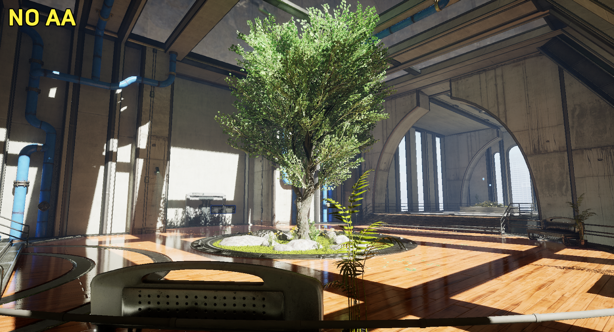
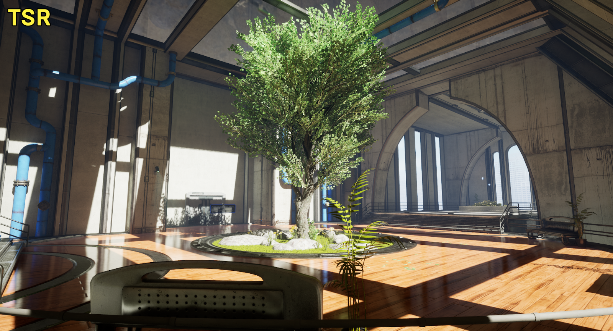
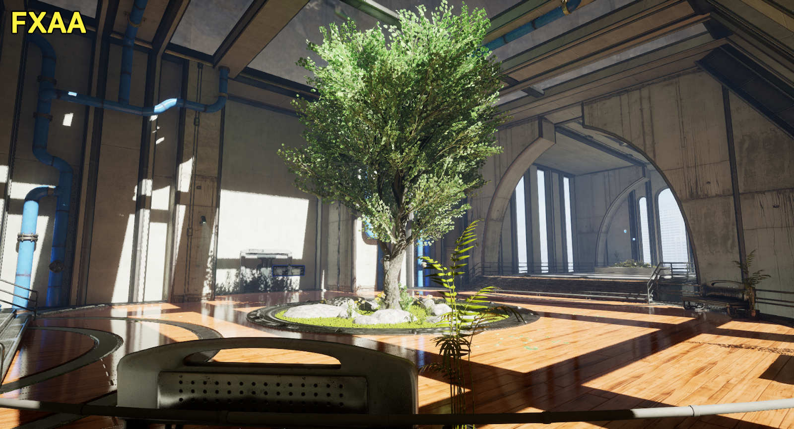
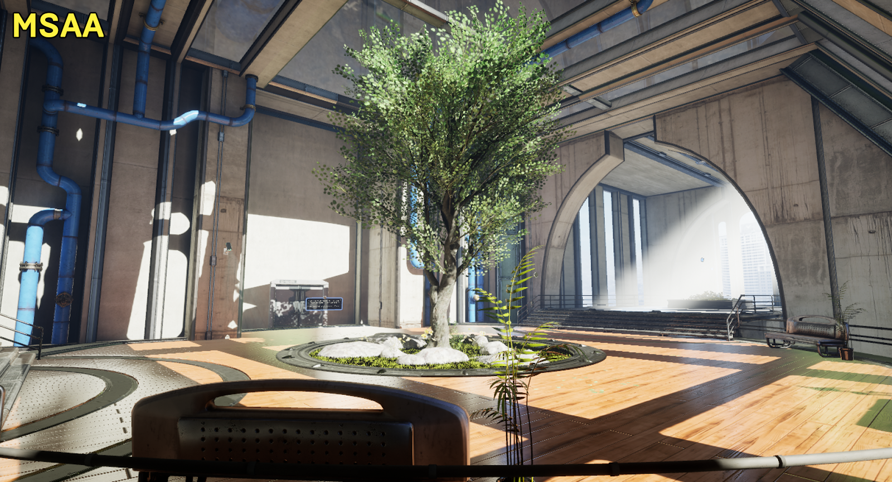

抗锯齿（Anti-Aliasing）是指在原本应该平滑的边缘和对象上删除锯齿状或阶梯状线条。抗锯齿的方法有很多种，可以减少这些类型的视觉瑕疵。有些方法用于特定渲染器和平台，而有些则非常适合提高性能和保真度。

|抗锯齿方法|台式机/主机：延迟渲染器|台式机/主机：正向渲染器|移动：延迟渲染器|移动：正向渲染器|
|---------|--------------------|--------------------|---------------|-------------|
||Y         |Y                    |N              |N|
||Y         |Y                   |Y           |N|
||Y         |Y                    |Y             |N|
||N         |Y                    |N             |Y|

# 时间超级分辨率（TSR）
# 时间抗锯齿上采样（TAAU）
# 快速近似抗锯齿（FXAA）
# 多重采样抗锯齿（MSAA）