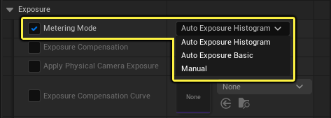

后期处理体积（Post Process Volume） 提供 自动曝光（Automatic Exposure） （通常称为眼部适应）控制选项，可自动调整当前场景视图的明暗。此效果可再现人眼适应不同光照条件的体验，例如从昏暗的室内走到明亮的室外，或从室外走到室内。

# 曝光测光模式

在场景中设置自动曝光时，引擎提供几种测光模式选项。此类不同测光模式提供可精确模拟实际摄像机的设置，可在后期处理过程中控制场景中的曝光。

- 自动曝光直方图（Auto Exposure Histogram） 模式通过由64bin直方图构成的高级设置更好地控制自动曝光。这是虚幻引擎中的默认曝光测光模式。
- 基本自动曝光（Auto Exposure Basic） 模式提供的设置较少，但这是通过下采样曝光计算单个值的更快速方法。
- 手动（Manual） 模式支持使用后期处理和摄像机设置中的 摄像机（Camera） 设置控制曝光，而非仅使用 曝光（Exposure） 类别中的设置。

## 直方图和基本算法