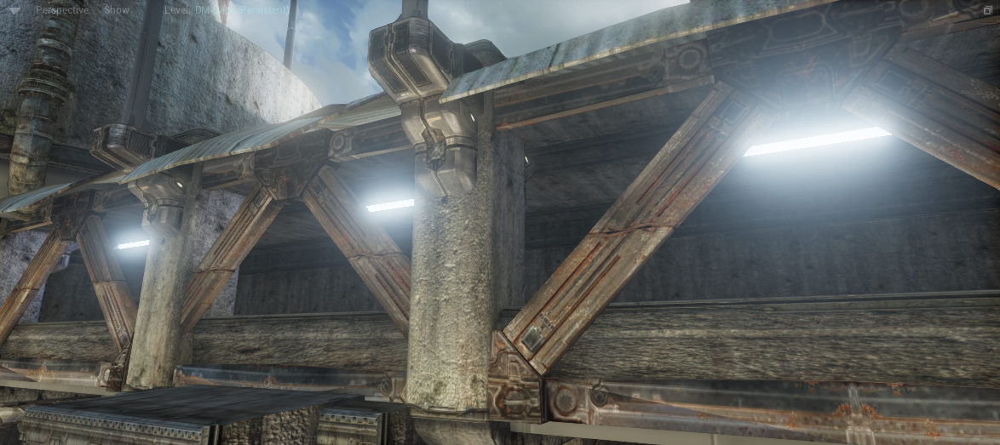
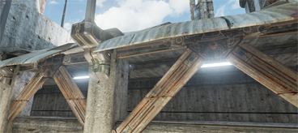
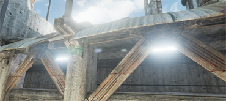
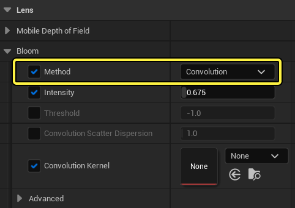

泛光（Bloom）是一种真实世界中的光现象，通过它能够以较为适度的渲染性能成本极大地渲染图像的真实感。用肉眼观察黑暗背景下非常明亮的物体时会看到泛光效果。亮度更高的物体还会造成其他效果（条纹、镜头光斑），但这些效果不在经典的泛光效果范畴内。我们的显示器（电视、TFT屏等）通常不支持HDR（高动态范围），因此实际上无法渲染太亮的物体。于是我们模拟了当光线射到胶片（胶片次表面散射）或摄像机（乳白色玻璃滤光片）时眼睛中出现的效果（视网膜的次表面散射）。这种效果不一定符合实际清空，但它可以帮助表现对象的相对亮度，或者给屏幕上显示的LDR（地动态范围）图像添加真实感。

泛光可以用一个高斯模糊来实现。为了提高质量，我们将多个不同半径的高斯模糊组合起来。为了获得更好的性能，我们在大大降低的分辨率下 进行很宽范围的模糊。在UE 3中，高斯模糊的分辨率为1/4、1/8和1/16。而现在我们可以使用多种模糊，分辨率从1/2（Blur1）到1/32（Blur5）。

通过改变模糊效果的组合方式，我们可以进行更多的控制，取得更高的质量。为了获得最佳的性能，应该使用高分辨率模糊（小值）来实现较窄的模糊，而主要使用低分辨率模糊 （大值）实现较宽的模糊。

|属性|说明|
|--|--|
|强度（Intensity）|线性调节整个泛光效果的颜色。可用于：随着时间的推移淡入或淡出，变暗。 |
|阈值（Threshold）|定义了单一颜色需要多少亮度单位才能产生泛光。除了阈值之外，还有一个线性部分（1个单位宽度），其中的颜色仅部分地影响泛光。如果希望场景中的所有颜色都参与泛光效果，需要使用数值-1。可用于：对某些不真实的HDR内容、梦序进行调整。详见下方示例|
|着色|修改每个泛光的亮度和颜色。如果你使用黑色，尽管不会使得渲染速度加快，但也是可以的。|
|

## 强度

# 泛光卷积

使用泛光 卷积（Convolution） 效果可以添加自定义泛光内核形状，其纹理能够展现逼真的泛光效果。 它利用内核图像对源图像进行卷积运算，以此来模拟摄像机或人眼中光线的散射和衍射。

内核表示光学设备对视野中间的单点源的响应。源中的每个像素按照内核图像的指示 将其部分亮度贡献给相邻像素。源像素越亮，生成的泛光越明显。究其根本而言，这种能量守恒散射可以转化为卷积运算公式， 并通过使用快速傅里叶变换（FFT）加速。

> 泛光卷积专门用于游戏内过场动画、离线过场动画，或在高端硬件中使用，但 标准 泛光 可用于大多数游戏应用程序。 就利弊而言，标准泛光在性能方面具有明显优势，但它并不稳妥（它会导致图像整体变得更亮）， 并且无法赶上泛光卷积的视觉复杂性。

要启用"泛光卷积（Bloom Convolution）"，请在"后期处理体积（Post Process Volume）"的 镜头（Lens） 部分中，使用 方法（Method） 旁边的选择框选择 卷积（Convolution）。

|属性|说明|
|--|--|
|卷积内核（Convolution Kernel） |用于选择定义内核的纹理。|
|卷积缩放（Convolution Scale）  |	表示以视口为单位的卷积内核图像的相对大小。默认值为1。主要用于减少泛光的大小。|

## 内核图像最佳实践

基于图像的卷积之所以能产生额外的真实感，是因为它能够使用视觉上很有趣的非对称内核图像。当 创建内核并将其设置用于泛光卷积时，需要注意一些事项。