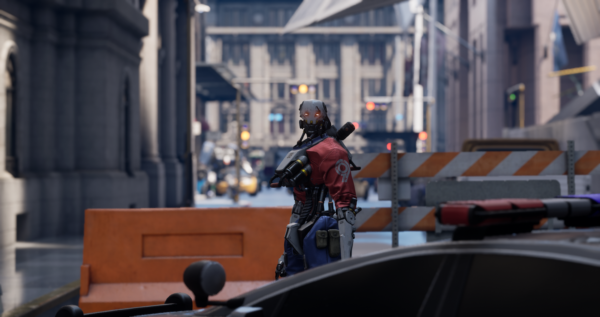

以下景深方法具有影视级视觉效果，十分接近使用延迟着色渲染器和群集前向渲染器的桌面及主机平台上照片和电影的效果。

类似于圆圈景深和散景景深，"影视级"景深的效果跟真实摄像机不相上下，你可以在锐化[高动态范围 (HDR)]()内容中看到圆形散景（离焦区域）。此方法使用程序化散景模拟技术，具有动态分辨率稳定性和阿尔法通道支持，在台式机和主机上开发的项目还具有更快速、可扩展和性能优化等特性。

# 对焦拍摄对象

实现美学意义上宜人景深效果的关键在于对焦拍摄对象。对于特定拍摄情形，影响景深设置的核心因素有三个：
- 确定镜头要使用的 焦距（Focal Length）。
- 选择合适的 孔径（Aperture）（F值）。
- 选择拍摄对象与摄像机之间的 对象距离（Distance to your Subject）。

为了理解调整这些设置时会产生怎样的效果，我们来分析一下构成摄像机和拍摄场景的各个要素：