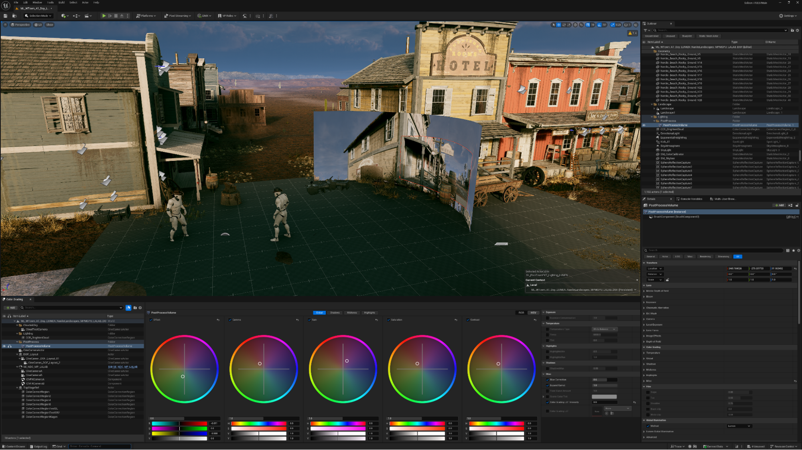
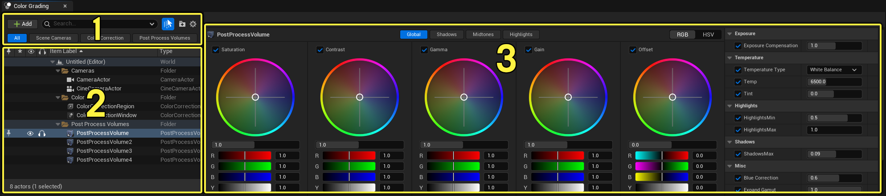

颜色分级面板是一个专用的界面，用于在场景中操纵颜色。它使用可以执行颜色分级操作的角色，如后期处理体积和颜色校正区域。

您可以使用此窗格直接配置颜色分级属性和设置，而不是通过任何单个Actor的详细信息面板。这将使美术人员的配置更直接。

# 色彩分级面板接口

您可以通过选择Window > Color Grading从编辑器的主菜单打开Color Grading面板。这个面板在关卡视口的底部打开。

