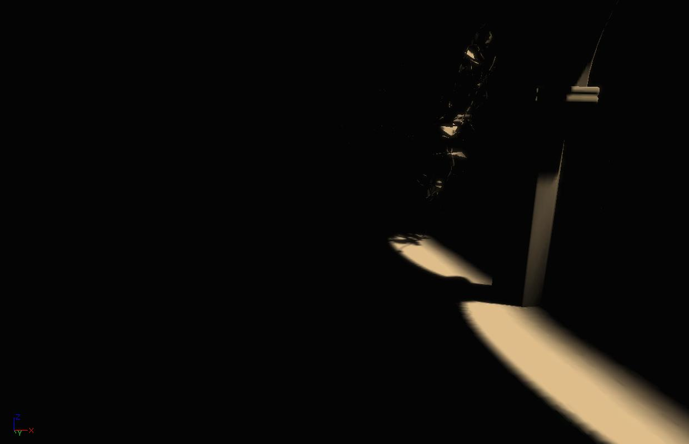

全局光照（Lightmass）创建具有复杂光交互作用的光照图，例如区域阴影和漫反射。它用于预计算具有固定和静态运动型的光源的光照共享部分。

编辑器和全局光照之间的通信由Swarm Agent处理，它管理本地的光照构建，也可以将光照构建分发到远程机器。默认情况下以最小化方式打开的Swarm Agent还会跟踪光照构建进度，并让你了解哪些机器为你工作，它们在做什么，以及每个机器使用了多少线程。

# 静态和固定光源的特性
## 漫反射
漫反射（Diffuse Interreflection）是目前为止视觉上最重要的全局光照效果。在默认情况下，光源以全局光照反射，而材质的基本颜色（BaseColor）项控制有多少光（和什么颜色）向各个方向反射。这种效果有时称为渗色。漫反射是入射光在各个方向上均匀反射，即不受观测方向或位置的影响。

这里是一个由全局光照创建的场景，只有一个方向的光，且仅显示直接光照。光源无法直接照射的区域是黑色的。这是没有全局光照的结果。

