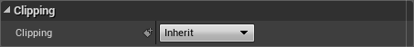

# [构建用户界面](https://dev.epicgames.com/documentation/zh-cn/unreal-engine/basics-of-user-interface-development-in-unreal-engine)
# [UMG编辑器参考](https://dev.epicgames.com/documentation/zh-cn/unreal-engine/umg-editor-reference-for-unreal-engine)
## [Slate后缓冲区](https://dev.epicgames.com/documentation/zh-cn/unreal-engine/using-slate-postbuffers-in-unreal-engine)
# [Slate UI框架](https://dev.epicgames.com/documentation/zh-cn/unreal-engine/slate-user-interface-programming-framework-for-unreal-engine)
## [Slate 架构](https://dev.epicgames.com/documentation/zh-cn/unreal-engine/understanding-the-slate-ui-architecture-in-unreal-engine)
## [Slate裁剪系统](https://dev.epicgames.com/documentation/zh-cn/unreal-engine/using-the-slate-clipping-system-in-unreal-engine)
### 启用控件裁剪
对于所有UMG控件而言，用户可以调整所选控件 Details 面板中的 Clipping 属性。

如需在代码中启用裁剪，需要将`EWidgetClipping`的裁剪属性设为以下其中一个状态：
- Inherit
- ClipToBounds
- ClipToBoundsWithoutIntersecting
- ClipToBoundsAlways
- OnDement

# [文本格式设置、本地化和字体](https://dev.epicgames.com/documentation/zh-cn/unreal-engine/text-formatting-localization-and-fonts-in-unreal-engine)
# [优化用户界面](https://dev.epicgames.com/documentation/zh-cn/unreal-engine/optimizing-user-interfaces-in-unreal-engine)
# [测试和调试](https://dev.epicgames.com/documentation/zh-cn/unreal-engine/testing-and-debugging-user-interfaces-in-unreal-engine)
# [UI开发插件](https://dev.epicgames.com/documentation/zh-cn/unreal-engine/plugins-for-ui-development-in-unreal-engine)
# [控件类型参考说明](https://dev.epicgames.com/documentation/zh-cn/unreal-engine/widget-type-reference-for-umg-ui-designer-in-unreal-engine)
# [用户界面教程和示例](https://dev.epicgames.com/documentation/zh-cn/unreal-engine/tutorials-and-examples-for-user-interfaces-in-unreal-engine)