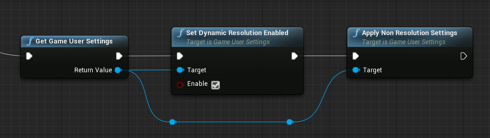
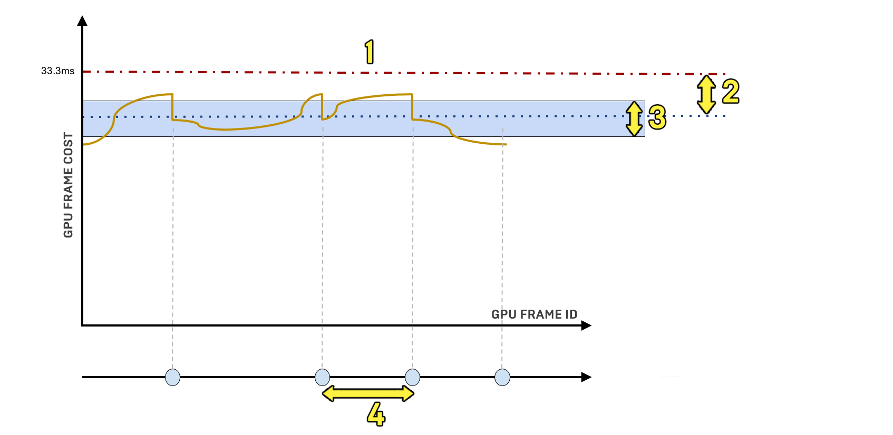
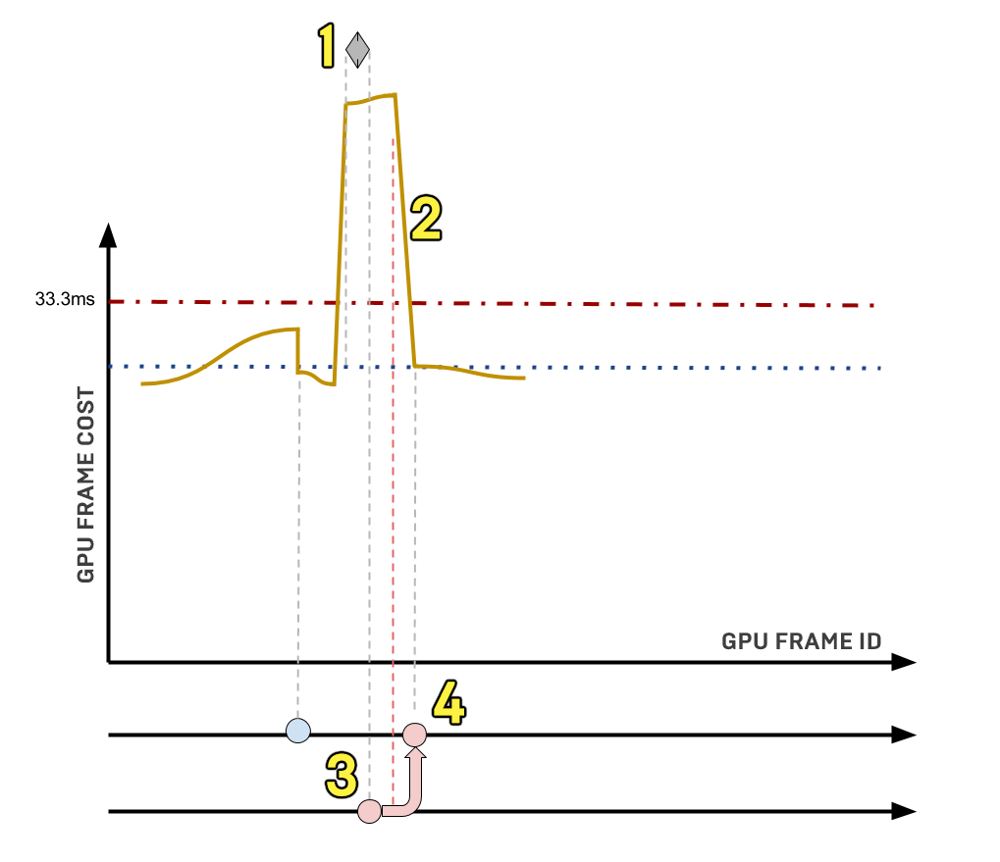

动态分辨率可根据先前画面的GPU工作负载调节主要屏幕百分比。分辨率是基于启发法（按需要）调节的，例如，如果在屏幕上有太多Object，或者有成本高昂的效果突然进入画面，GPU渲染时间将会延长，此时为了维持目标珍露就会降低屏幕分辨率。

# 启用动态分辨率
## 在运行时启用动态分辨率

动态分辨率可以通过在 Game User Settings 节点上获取一个布尔数值来启用。你可以在使用蓝图或C++时设置它。

在 蓝图 中，你可以使用 Game User Settings 节点选择此功能来启用动态分辨率，如下图：



在 C++ 中，你可以在 UGameUserSettings 设置如下布尔值：

```C++
GEngine->GetDynamicResolutionStatus()->SetEnabled(true);
```

将 SetEnabled 设置为 false 可将其禁用。

> 在实际启用或禁用动态分辨率时，游戏线程逻辑掌握最终程序控制权限，所以如果你是用蓝图在运行时启动它，这会优先于代码设置。要将游戏用户设置恢复到初始状态，请使用以下命令行：
> ```
> GEngine->GameUserSettings->ApplyNonResolutionSettings();
> ```

## 使用运算模式控制动态分辨率

你可以使用 **运算模式（Operation Mode）** 设置如何在游戏中覆盖和使用动态分辨率，设置在游戏中覆盖它和使用它的方式。为了控制这种模式，在项目所对应平台（Xbox One、PlayStation 4等）的平台配置描述（或设备描述）中，你可以使用下列控制台命令：

```
r.DynamicRes.OperationMode
```

使用下列数值之一来设置运算模式如何针对项目的平台工作：
- 根据游戏用户设置状态（在C++或蓝图中设置）启用动态分辨率。
- 无论游戏用户设置状态如何都启用动态分辨率。

启用动态分辨率后，下列控制台变量会设置屏幕百分比的最大值和最小值，以及在降低分辨率之前任何给定帧的最大预算。如果你不设置，这些变量都有默认值：

|控制台变量|默认值|描述|
|--|--|--|
|r.DynamicRes.MinScreenPercentage   |50     |设置要使用的最小屏幕百分比。|
|r.DynamicRes.MaxScreenPercentage   |100    |设置用于分配渲染目标的最大主要屏幕百分比。|
|r.DynamicRes.FrameTimeBudget       |33.3   |设置帧预算（以毫秒为单位）。|

>你可以使用Unreal Engine中的"设备描述（Device Profiles）"窗口设置和管理配置文件。可以通过"文件（File）"菜单选择 编辑（Edit）> Developer Tools（开发者工具）> Device Profiles（设备描述） 来访问此窗口。

## 暂停和恢复动态分辨率

有时你可能需要为项目启用动态分辨率，但你又不想对主大厅之类的区域启用。动态分辨率可以随运作模式暂停和恢复。下列控制台变量可用于设置动态分辨率的运算模式：

```
r.DynamicRes.OperationMode
```

|数值|描述|
|--|--|
|0  |禁用（默认）|
|1  |根据GameUserSettings中使用的设置启用。|
|2  |无论GameUserSettings中的设置如何都会启用。|

下表概括了当启用或禁用特定运算模式时可用的不同状态，以及GameUserSettings所受的影响：

||Game User Settings = False||Game User Settings = True||
|--|--|--|--|--|
|               |暂停|不暂停|暂停|不暂停|
|OperationMode=0|否 |否|否|否|
|OperationMode=1|否 |否|否|是|
|OperationMode=2|否 |是|否|是|

在 C++ 中，你可以使用下列函数控制和检查动态分辨率的状态：

|操作|C++函数|
|--|--|
|暂停|GEngine->PauseDynamicResolution();    |
|恢复|GEngine->ResumeDynamicResolution();   |
|检查状态（禁用/启用或暂停）|GEngine->GetDynamicResolutionStatus();|

# 动态分辨率巡航

在虚幻引擎中，动态分辨率功能的实现与以前其他引擎中同类功能有所不同，因为我们允许分辨率根据需要在一个给定的范围内变化，而不是限制为单一的分辨率（1080p、900p、720p）。在这张示例图中，此模型演示了控制台变量所控制的对象。它演示了当一切都运行顺利、没有超过给定帧的预算时，动态分辨率是如何在给定范围（3）中自动调节的。可以把这个范围想象为飞机的巡航高度，飞机在这一高度范围可以自由机动，以实现到达目的地的理想速度。和飞机一样，分辨率也可以根据需要上下调节，从而在分辨率和充足的性能之间保持良好的平衡。

> 这个模型是用于演示的，没有考虑在给定场景中发生的所有情况。例如，它没有体现GPU不与CPU同步会是什么情况，甚至也没有体现启发法正确估算出分辨率应该变化多少的情况。它的目的是清晰地演示"理想"情况，从而展现动态分辨率控制态变量的运算方式。



|参考号|控制台变量|描述|
|--|--|--|
|1|r.DynamicRes.FrameTimeBudget|以毫秒（ms）计的帧时间预算。|
|2|r.DynamicRes.TargetedGPUHeadRoom|在超出预算前可供GPU增加的余量（按帧预算的百分比计）。这很可能要取决于发布平台或根据启用的渲染功能而定。例如，动态模糊需要另外留出成本余量用于摄像机的快速旋转运动。|
|3|r.DynamicRes.ChangePercentageThreshold|为了实际调整分配大小，在屏幕百分比中需要的最小变化。如果不想经常在非常相近的分辨率大小之间变换，可以利用此变量。如果它的数值过小，分辨率最终可能还是会经常改变，而如果它过大，可能会增加超出GPU预算的风险。|
|4|r.DynamicRes.MinResolutionChangePeriod|在允许进行任何分辨率更改之前，必须达到的最小帧数。此命令有多种用途。这包括提高启发法在给定主要屏幕百分比下排除测量噪点模拟GPU消耗的可靠性，避免可能在逐帧偏移抖动之间发生的时序上采样的输入样本偏移干扰，以及更改可能造成抗锯齿发散的分辨率。|

如果你的瓶颈是在CPU而非GPU，还可以使用下列控制台变量调节用于动态分辨率的启发法历史记录和要使用的屏幕百分比：

|控制台变量|描述|
|--|--|
|r.DynamicRes.HistorySize|启发法帧历史记录中的帧数。如果历史记录过短，可能包含过多噪点，影响可靠性；而如果历史记录过长，调节延迟可能会非常严重。|
|r.DynamicRes.CPUBoundScreenPercentage|当你遇到CPU瓶颈时应该瞄准的主要屏幕百分比。如果平台上的CPU和GPU共享相同的内存带宽，可以用它设置较低的屏幕百分比来降低分辨率。|

## 超预算应急

如果你发现动态分辨率会非常迅速地超出预算，例如在镜头切换时或者成本高昂的视觉效果出现时，那就说明使用的启发法实际上无法预测这种情况何时会发生。在这类情况确实发生时，可以使用某种"应急"按钮快速降低分辨率，从而减少超出预算的帧数。如果启发法发现有N（一定数量）个连续帧的可用GPU时间超出预算，它将会立即调整分辨率来应对这些超预算时间。它还会自动执行历史记录重置，使得先前成本较低的帧时间不会影响启发法对成本较高的帧的判断。

请使用下列控制台命令来控制在启用"应急"开关降低分辨率之前可以出现的超GPU预算的连续帧数：

```
r.DynamicRes.MaxConsecutiveOverbudgetGPUFrameCount
```

在此图中，画面中突然发生跳跃，因此有两个以上的连续帧超过了设定的33.3毫秒的预算。系统激活了应急开关来快速降低分辨率，使得后续帧不再超出预算。



1. 超出预算的最大连续GPU帧数。
2. 从检测到GPU导致分辨率变化为止未与渲染线程同步的帧延迟。
3. 发生紧急情况检测，引发帧率下降。
4. 一定数量的帧发生分辨率更改。

# 支持动态分辨率的平台

支持以下平台
- 微软的Xbox One、Xbox Series S和Xbox Series X
- PlayStation 4 和 PlayStation 5 （不包括PSVR）
- Nintendo Switch

> 针对不在此白名单中的平台启用动态分辨率支持是很危险的，可能造成意外后果。这类后果包括GPU时间错误，这可能使分辨率不必要地下降，或者分辨率提高过多，发生丢帧。这最终可能毁掉Gameplay体验。默认情况下，引擎不允许你在此白名单中的平台上使用动态分辨率。