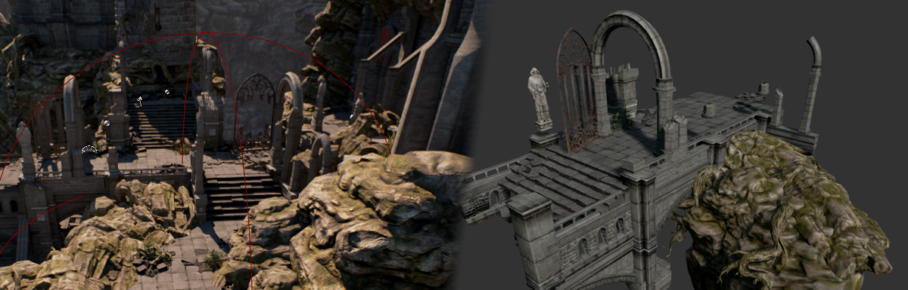

就其最简单的形式而言，分层细节级别（Hierarchical Level of Detail）（简称HLOD）将预先存在的静态网格体Actor组合为一个单一的HLOD代理模型和材质（带有图谱纹理）。因为HLOD可以将每个代理模型的多个绘制调用减少为一个调用，而不是每个静态网格体Actor一个绘制条用，因此使用它可以提升性能。生成HLOD代理模型时，可以调整几个参数，这些参数有助于定义如何将静态网格体Actor作为群集分组在一起，它们最终被编译到代理模型中。