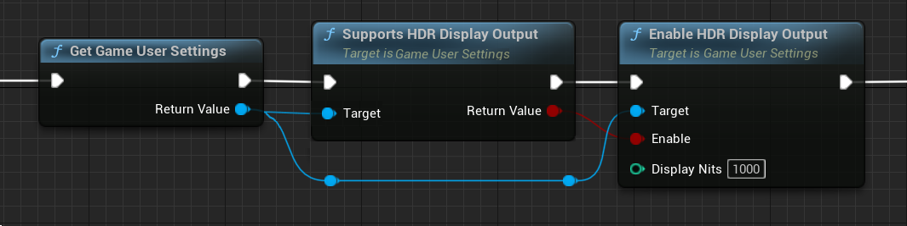

你可以输出到高动态范围（HDR）显示器，以充分利用更高的对比度和更宽的色域等功能！其目标是使显示的图像具有的特性更类似于"现实世界"中所经历的自然光条件。这是转向 学院色彩编码系统（ACES）标准行动的一部分，该标准是一个确保在多种格式和显示器上保持色彩一致性的管线，也是一种确保所用源材质 不会过时 且无需针对其他介质进行调整的方法

在当前实现下，渲染场景的完整处理通过 ACES Viewing Transform 进行处理。此流程的工作原理是使用"参考场景的"和"参考显示的"图像。
- 参考场景的 图像保有源材质的原始 线性光照 数值，不限制曝光范围。
- 参考显示的 图像是最终的图像，将变为所用显示的色彩空间。

使用此流程后，初始源文件用于不同显示时便无需每次进行较色编辑。相反，输出的显示将映射到正确的色彩空间。

ACES Viewing Transform在查看流程中将按以下顺序进行：
- Look Modification Transform (LMT) - 这部分抓取应用了创意"外观"（颜色分级和矫正）的ACES颜色编码图像，输出由ACES和Reference Rendering Transform（RRT）及Output Device Transform（ODT）渲染的图像。
- Reference Rendering Transform (RRT) - 之后，这部分抓取参考场景的颜色值，将它们转换为参考显示。 在此流程中，它使渲染图像不再依赖于特定显示器，反而能保证它输出到特定显示器时拥有正确而宽泛的色域和动态范围（尚未创建的图像同样如此）。
- Output Device Transform (ODT) - 最后，这部分抓取RRT的HDR数据输出，将其与它们能够显示的不同设备和色彩空间进行比对。 因此，每个目标需要将其自身的ODT与Rec709、Rec2020、DCI-P3等进行比对。

# 启用HDR输出

开启控制台变量或使用蓝图中的 GameUserSettings 节点即可启用运行时的HDR输出。

Game User Settings 控制将自动锁定当前可用的最接近输出设备，并相应设置全部标记。 另外，还可使用以下控制台变量启用并对HDR设备和色域输出所需的可用选项进行修改。

# HDR 中的低动态范围（LDR）UI支持

启用HDR输出后，用户界面（UI）可能出现显示问题。 因此虚幻引擎新增了实验性的LDR UI合成支持。 它将尝试尽量匹配LDR的外观。 推荐对UI稍微进行增强，以免和鲜艳主场景相比之下显得黯淡。