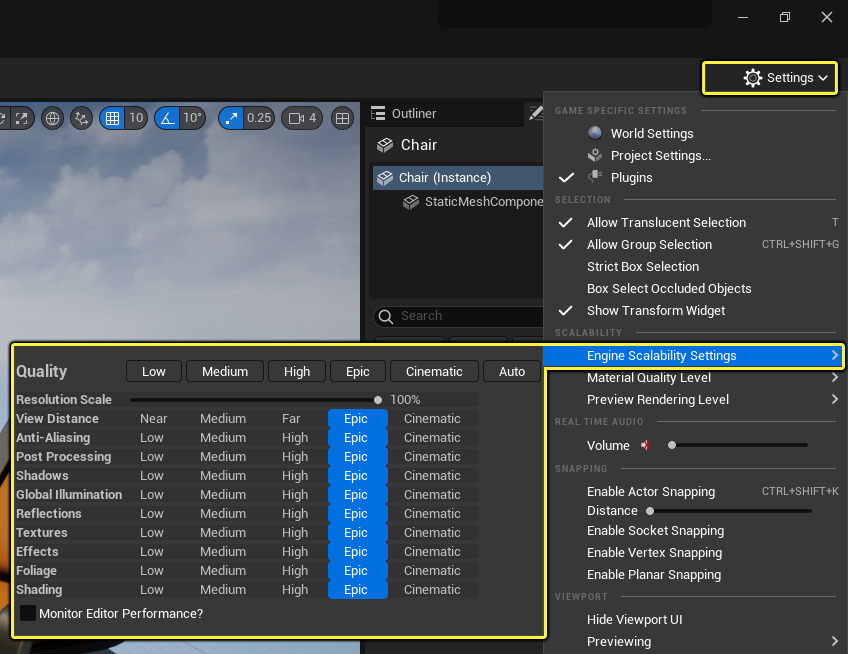

Lumen的目标是，能够在主机上分别以8毫秒和4毫秒的帧预算实现30和60FPS，并为不透明和半透明材质以及体积雾实现全局光照和反射效果。引擎采用了一系列预先配置好的"可扩展/弹性（Scalability）"设置让Lumen应对不同的目标帧率需求。超高（Epic） 级别对应的帧率为30FPS。高（High） 级别对应的目标帧率为60FPS。

Lumen依赖[时间上采样](https://zentia.github.io/p/%E5%8A%A8%E6%80%81%E5%88%86%E8%BE%A8%E7%8E%87/)和虚幻引擎5的[时间超级分辨率](https://zentia.github.io/p/%E6%97%B6%E9%97%B4%E8%B6%85%E7%BA%A7%E5%88%86%E8%BE%A8%E7%8E%87/)（TSR）功能来提供4k输出。Lumen和一些其他功能本身只使用较低的内部分辨率（1080p），这样能赋予TSR最佳的最终图像质量。否则，如果直接以4K原生分辨率渲染这些功能，则需要降低质量设置，这样才能实现30或60 FPS的帧率。

# 可扩展性设置

你可以在关卡编辑器中的 设置（Settings）> 引擎可扩展性设置（Engine Scalability Settings） 视口下找到可扩展性设置。在游戏中，请使用GameUserSettings和图形设置菜单来控制可扩展性设置（相关示例请参阅Lyra项目）。Lumen的品质可以通过 全局光照（Global Illumination） 和 反射（Reflections） 质量组进行设置：
- 电影级（Cinematic） 可扩展性级别适合用于影片渲染队列。
- 超高（Epic） 可扩展性级别的性能目标是在主机上实现30 FPS。 
- 高（High） 可扩展性级别的性能目标是在主机上实现60 FPS。
- 低（Low） 和 中（Medium） 可扩展性级别下，Lumen功能会被禁用。



默认情况下，虚幻引擎在主机上的性能目标是30 FPS。如需以60 FPS为目标，将 全局光照（Global Illumination） 和 反射（Reflections） 质量组设置为 高（High） 。相关配置描述位于 [你的项目名称]\Platforms[主机]\Config\ 文件夹。例如，[你的项目名称]\Platforms\PS5\Config\PS5DeviceProfiles.ini 。

例如，以60 FPS为目标的PlayStation 5的设备描述如下所示：

```c++
[PS5 DeviceProfile]
;将Lumen GI和反射质量设置为"高"，目标为60 fps
+CVars=sg.GlobalIlluminationQuality=2
+CVars=sg.ReflectionQuality=2
```

# 其他质量级别(不启用Lumen)

全局光照（Global Illumination） 和 反射（Reflections） 的默认质量设置位于 \Engine\Config\BaseScalability.ini 中。这些设置会试图让间接光照的品质在不同质量级别下保持相似。这么做的额外好处是，你无需在不同平台上重新设置你的光照参数，同时还能缩减Lumen的开销。

中质量级别
- 对于大规模的环境光遮蔽， 距离场环境光遮蔽（Distance Field Ambient Occlusion） 会取代 Lumen全局光照（Lumen Global Illumination） 。
- 对于小规模的环境光遮蔽，会启用 屏幕空间环境光遮蔽（Screen Space Ambient Occlusion） 。

低质量级别
- 仅使用无阴影的天空光照。
- 降低天空光照强度（r.SkylightIntensityMultiplier=0.7），以近似模拟 中（Medium） 质量级别中的效果，因为此时没有天空光照阴影。

## 软件光线追踪