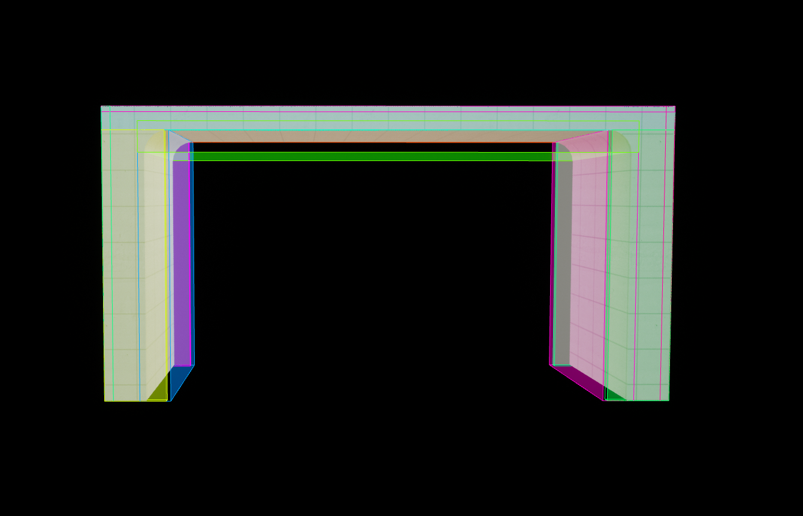
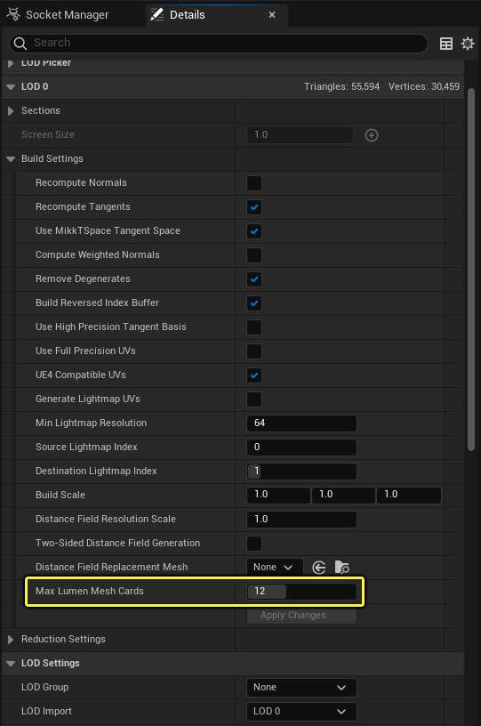
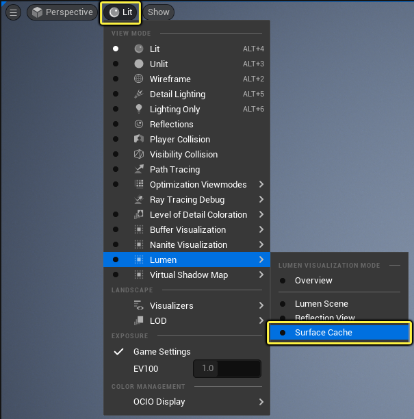
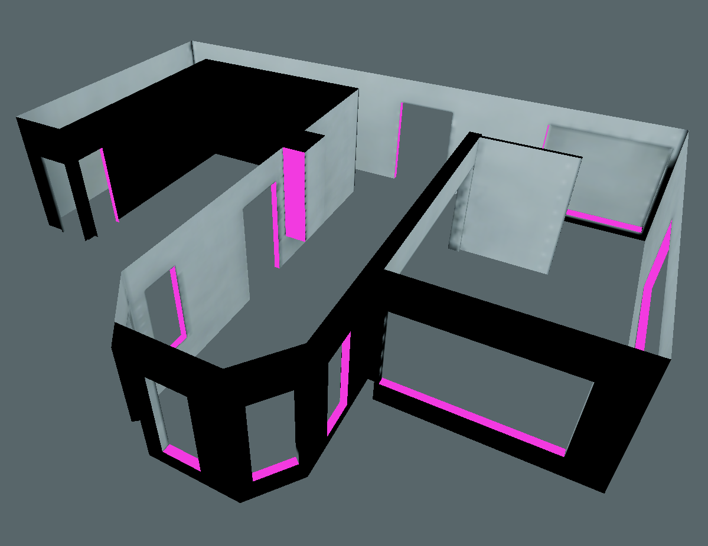
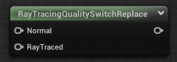

Lumen使用多种光线追踪方法来解决全局光照和反射。首先执行屏幕追踪，然后使用更加可靠的方法。在默认情况下，Lumen通过有向距离场使用 软件光线追踪（Software Ray Tracing） ，同时在启用 硬件光线追踪（Hardware Ray Tracing） 时，在支持的视频显卡上达到更高品质。

> Lumen的全局光照和反射最初的主要目标是支持在下一代主机上以每秒60帧（FPS）运行的大型开放世界。引擎的 高（High） 可扩展性级别中就包括以60FPS为目标的Lumen设置。
>
> Lumen的次要关注点就是在下一代主机上以30FPS实现通透的室内光照。引擎的 超高（Epic） 可扩展性级别在下一代主机上能够在8毫秒内以1080p内部分辨率实现全局光照和反射，这个目标依赖[时序超分辨率（TSR）](https://zentia.github.io/p/%E6%97%B6%E9%97%B4%E8%B6%85%E7%BA%A7%E5%88%86%E8%BE%A8%E7%8E%87/)来输出接近原生4K的画质。
>
> 更多关于Lumen性能的信息，请参阅[Lumens性能指南](https://zentia.github.io/p/lumens%E6%80%A7%E8%83%BD%E6%8C%87%E5%8D%97/).

# 表面缓存
Lumen生成附近场景表面的自动参数化，这种方法称为 表面缓存（Surface Cache） 。使用这种方法可以快速查找场景中光线接触点的光照。Lumen会从多个角度捕获每个网格体的材质属性。这些捕获位置（即 卡片（Cards） ）是针对每个网格体脱机生成的。

可以使用控制台命令 `r.Lumen.Visualize.CardPlacement 1` 来可视化卡片。

默认情况下，Lumen在一个网格体上放置12个卡，但可以通过在静态网格体编辑器的 构建设置（Build Settings） 中设置 最大Lumen网格体卡片数量（Max Lumen Mesh Cards） 来增加该数量。调整卡的数量对于更复杂的内部或具有不规则形状的单个网格体非常有用。

没有表面缓存覆盖的区域将在关卡编辑器的 表面缓存(Surface Cache) 视图模式中变成粉色。

> 这些区域不会反射光线，在反射过程中显示为黑色。此类问题可以通过增加最大Lumen网格体卡片数量中的卡片数来解决，但可能无法解决所有问题。或者，将网格体分解成不太复杂的几部分也可以解决这类问题。

具有视图相关逻辑的材质，例如像素深度、摄像机位置或摄像机矢量，在Lumen表面缓存视图模式下看起来可能不正确。使用这些节点的材质可能使用 光线追踪质量切换（Ray Tracing Quality Switch） 节点来提供采用Lumen表面缓存的材质版本，或为复杂材质而优化表面缓存捕获。

> 如需详细了解如何使用光线追踪质量切换节点，请参阅光线追踪性能指南。

Nanite可以加速用于使表面缓存与三角形场景保持同步的网格体捕获。尤其是多边形网格体，需要使用[Nanite](https://zentia.github.io/p/nanite%E8%99%9A%E6%8B%9F%E5%87%A0%E4%BD%95%E4%BD%93/)进行有效捕获。只有网格体使用了Nanite，才支持植被和实例化的静态网格体组件。