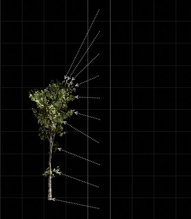
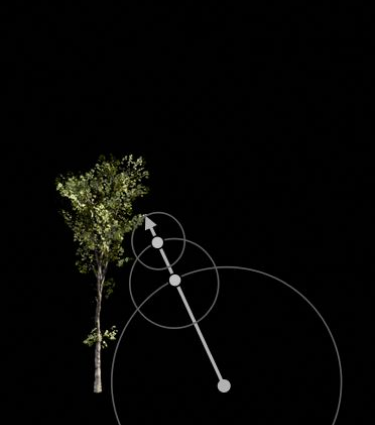

虚幻引擎 使用 距离场（Distance Fields） 的强大功能来实现游戏中静态网格体Actor的动态环境光遮蔽和阴影。除此之外，Actor的网格体距离场表达还可用于其他一些特性，例如GPU粒子碰撞，甚至还可以使用材质编辑器创建动态流动贴图等等。

继续阅读下面的内容可以了解网格体距离场的工作原理，以及可通过哪些方法把它应用在游戏中。

# 它的工作原理是什么？
此技术中使用的距离场是代表静态网格体表面的 有向距离场（Signed Distance Field） （SDF）。有向距离场在每个点将距离最近表面的距离保存到体积纹理中。网格体外的每个点保存的距离为正值，网格体内的每个点保存的距离为负值。以下示例跟踪并保存了为正的距离，以在稍后表现出树的形象。

SDF首个实用属性的作用是，在追踪光线时安全地跳过空白空间，因为到最近表面的距离已经明确（有时称这种方法为球体追踪）。只需区区几步就可以判定出交叉点。对距离场进行光线追踪将生成可见性效果， 也就是说如果光线和网格体交叉，光线就会投射出阴影。

距离场第二个实用属性的作用是，在追踪光线时，通过追踪经过遮挡物的距离最近的光线就可以计算出近似的锥体交叉点，而不产生额外成本。这种近似法可以利用距离场来实现非常柔和的区域阴影和天空遮蔽。这个属性是距离场环境光遮蔽的关键，因为少量的锥体即可为接收器点的整个半球计算出柔和的可见性。