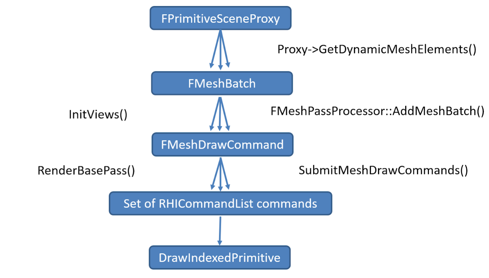

本页包含的信息适用于那些想要添加自定义网格体通道，或者想要理解虚幻引擎网格绘制性能特征的程序员。

网格体绘制管道基于保留模式的概念，其中所有场景绘制都是预先准备好的，而不是每帧都构建它们。它还具有积极缓存和绘制调用合并功能，以便利用静态网格体的属性，这些属性很少变化，可能跨帧重用。

网格体渲染从`FPrimitiveSceneProxy`开始，这是游戏线程的`UPrimitiveComponent`渲染线程表示。