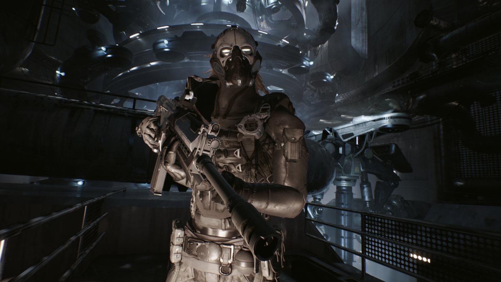
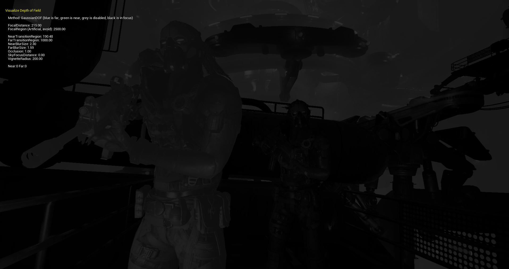
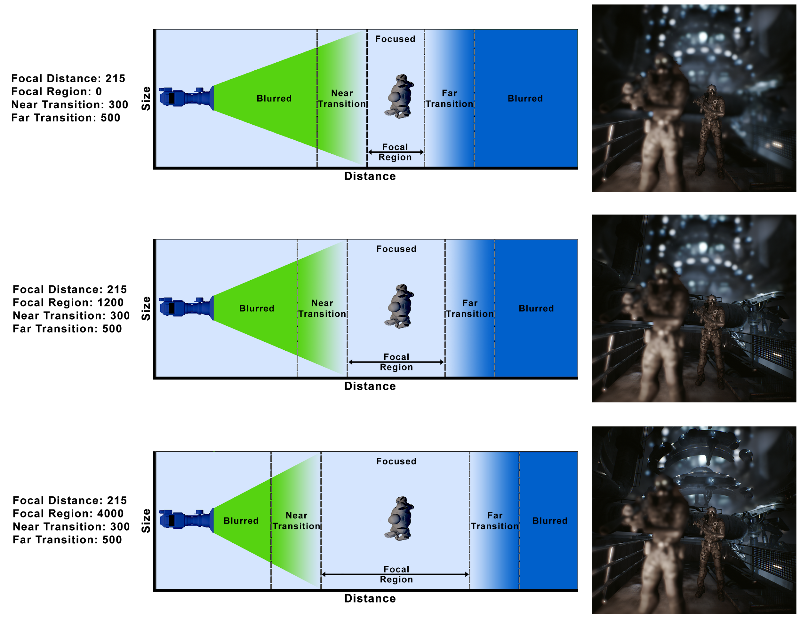

# 高斯
> 已移除高斯景深与 延迟渲染器（Deferred Renderer） 和 桌面前向渲染器（Desktop Forward Renderer） 的配合使用，该景深仅支持移动平台。如需在桌面计算机上在编辑器内工作时使用此高斯景深，请使用移动预览器启用其中一个移动平台预览器。

高斯 景深方法使用标准的[高斯模糊](https://zh.wikipedia.org/wiki/%E9%AB%98%E6%96%AF%E6%A8%A1%E7%B3%8A)（也叫高斯平滑）函数对场景进行模糊处理。高斯DOF使用固定大小的高斯模糊核对前景和背景进行模糊处理，在移动设备等低端硬件上它的速度非常快。在非常注重性能的场合，它可以在降低开销的情况下保持高性能。

# 查看景深

可以使用关卡视口中的 景深图层（Depth of Field layers） 显示标志来使包括过渡区在内的图层可视化，该显示标志位于 显示（Show） > 可视化（Visualize） 下。

# 对焦距离（Focal Distance）

对焦距离（Focal Distance） 表示对焦区域和捕捉的视角。焦距越长，景深越浅，对焦区域外的对象越模糊；焦距越短，景深越大，聚焦越准确而且失焦的对象越少。光圈数值可以保持不变，更改透镜尺寸将调整景深效果的深浅。

设置好 对焦距离（Focal Distance） 和 对焦区域（Focal Region） 之后，就可以使用 近过渡（Near Transition） 和 远过渡（Far Transition） 来调整对焦区域和完全模糊的场景之间的距离。另外，你甚至还可以调整 近景模糊尺寸（Near Blur Size） 和 远景模糊尺寸（Far Blur Size） 来进一步对高斯景深的外观进行微调。

在本示例中，为了实现近景和远景区域的柔和景深效果，我们设置了以下数值。
- 对焦距离（Focal Distance）： 215
- 影调范围（Scale）： 2500
- 近过渡（Near Transition）： 500
- 远过渡（Far Transition）： 400
- 近景模糊尺寸（Near Blur Size）： 2.0
- 远景模糊尺寸（Far Blur Size）： 2.5

# 可用设置

高斯景深的设置和属性可以在后期处理体积的 细节 面板中找到，位于 移动景深（Mobile Depth of Field） 的 镜头（Lens） 分类中。

