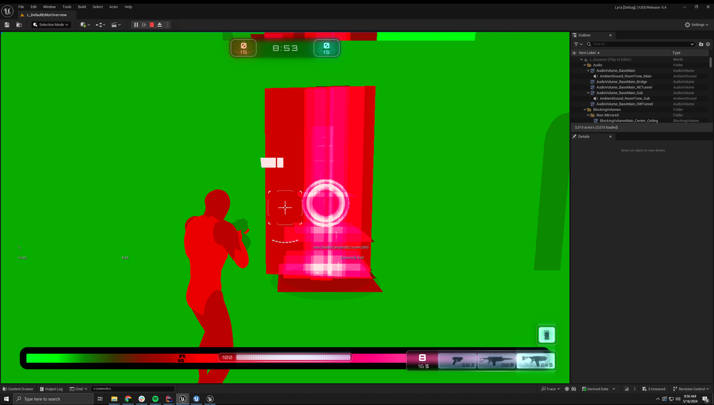

# 衡量性能
## 概述
衡量粒子的性能后，你将知道进行优化时应重点关注的具体区域。在做出更改之前验证假设非常重要，这可避免错误地优化无需优化地地方，而且这样可以有一个比较点，用来显示更改带来地影响程度。

本节将介绍虚幻提供地一些用于衡量Niagara粒子系统性能地工具，以及如何读取这些系统，和如何根据它们地数据做出决定。

## 衡量性能
### Unreal Insights-关卡中地衡量系统
捕获具有代表性的Gameplay窗口，最好是游戏本身，以便提供最具有参考价值的数据。适合某个项目的设置未必适合其他项目，甚至同一项目的不同关卡也是如此。
例如，带受摄像机的过长动画可能会有运行3D流体模拟的预算，但着如果在正常Gameplay期间运行，开销就太高了。

## 视图模式-衡量渲染复杂性
视觉特效通常有许多重叠的半透明Sprite和网格体，所以它们通常会到导致过渡绘制，因此验证Niagara系统的着色器复杂性也很重要。你可以在着色器复杂性视图模式查看复杂性的总体概况。要获得更详细的度过绘制视图，可以使用四边形过渡绘制视图模式。

减少颗粒数和进一步扩散粒子可以减少过渡绘制。粒子占据的屏幕控件越少，受到的关注就越少，在本例中也是如此。

# 伸缩性和最佳实践

## 概述
本节概述了多个策略，主要用来减少粒子系统在单个和总体关卡上所作的工作量。 上一节已经指出了执行额外工作的区域，本节将介绍在这些区域做出更改的工具和选项。通常，减少了执行的工作量，就可以避免不必要的工作，或者选择开销更少的解决方案。

## 实例数：减少关卡中的系统数量
即使一个系统经过了优化，如果关卡中这样的系统太多，也会影响性能。默认情况下，我们会使用Niagara World Manager批量刷新同一系统的实例，但系统的实例越多，游戏线程上需要执行的工作就越多。通常，在模拟的粒子数量不变的情况下，实例越多，达到的性能就越低，但拥有更多的实例可以让Niagara以更高的粒度剔除粒子，所以你需要在少量大实例与大量小实例之间进行权衡。

