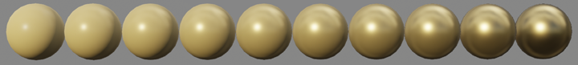
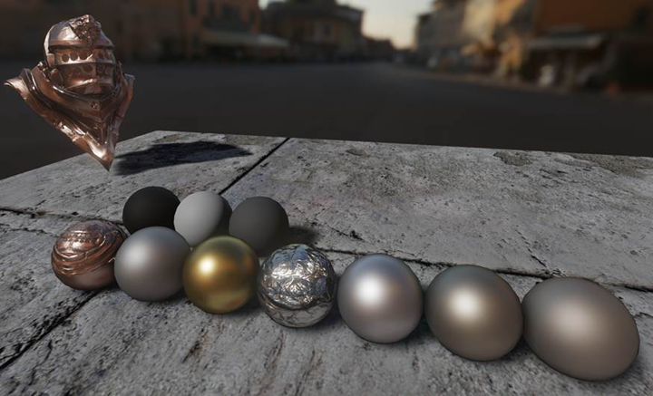

# 基于物理是什么意思？

基于物理的渲染（Physically based rendering） (PBR)意味着表面接近光线在真实世界的表现方式，而不是我们直观以为的应有方式。 相较于完全依赖美术师直觉来设置参数的着色工作流程，遵守PBR原则的材质更准确，并且通常看起来更自然。

基于物理的材质在所有光照环境中都能有同等程度的良好表现。 此外，材质值的复杂程度和相互依赖程度可以降低，这样材质创建工作流程对于用户更加友好。 这些优点甚至适用于非真实感渲染，正如Pixar [4]和Disney [3]的电影中所展现的那样。

> 要对虚幻引擎的基于物理的材质和着色模型进行一番深入的技术考察，请参阅此SIGGRAPH演示2。

# PBR材质属性

这些是与虚幻材质的基于物理的方面直接相关的材质属性。

- 基础颜色
- 粗糙度
- 金属感
- 高光度

> 所有这些输入都设计为接受0到1之间的值。对于基础颜色，这意味着RGB值在0到1之间的颜色或纹理取样。

## 基础颜色

基础颜色定义了材质的总体颜色。 "基础颜色"输入接受 Vector3 (RGB) 值，其中每个通道自动限制在0到1之间。

## 粗糙度

"粗糙度"输入控制了材质表面有多粗糙或光滑。 在材质中，这表现为反射在材质上看起来有多尖锐或模糊。

粗糙材质会沿比光滑材质更多的方向反射光线，这样产生的是漫反射，有时很细微。光滑表面会更均匀地反射光线，这样产生的是清晰、集中的反射或镜面高光。
- 粗糙度为0（光滑）会产生镜面反射。
- 粗糙度为1（粗糙）会产生漫反射或无光泽的表面。

### 映射粗糙度

粗糙度经常在使用灰阶纹理的对象上映射，以向表面添加物理变体。 粗糙度贴图上的深色区域在材质上看起来像镜子，而浅色区域则比较粗糙，看起来反射度较低。

### 粗糙度与高光度
高光度（Specularity） 指的是表面反射的[高光（specular light）](https://zh.wikipedia.org/wiki/%E9%8F%A1%E9%9D%A2%E5%8F%8D%E5%B0%84)量。 此值是材质类型所固有的，通常默认值0.5是准确的。"高光度"输入 不用于反射/高光度贴图 或添加表面变体。 这些应该在"粗糙度"贴图中进行处理。

## 金属感

"金属感"输入接受0到1之间的值，并定义你的材质是作为金属还是非金属表现。

在大多数情况下，你应该将"金属感"视为虚幻引擎中的二进制属性。 对于纯表面（例如纯金属、纯岩石、纯塑料，等等），你应该将"金属感"设置为 0或1，而不是中间值。创建被腐蚀、有灰尘或生锈的金属之类的混合表面时，你可能发现你需要0到1之间的某个值。
- 非金属 的"金属感"值为0。这是默认值。
- 金属 的"金属感"值为1。

> 你可能起初不愿意将材质设置为完全的金属感。除非你有充足理由，否则尽量不要使用小数值。

### 映射金属感

相同材质中往往金属和非金属都有。 假设一个金属面板，其中油漆涂层覆盖了部分或全部金属。

油漆是非金属，因此在油漆覆盖的所有区域中，"金属感"值应该为0。 在面板中看得到金属的所有地方，"金属感"值应该为1。

这应该使用传递到"金属感"输入的黑白遮罩进行处理。 油漆没有与金属混合，而是位于其上方。 你的"金属感"贴图不应包含中间灰阶值，只能包含黑色和白色。 你还可以使用材质层实现类似结果。

## 高光度

"高光度"输入接受0到1之间的值，并控制表面反射多少高光。
- "高光度"值为0表示完全不反射。
- "高光度"值为1表示完全反射。

虚幻引擎使用 默认高光度0.5 ，这表示大约4%的高光度反射。 对于绝大多数材质，此值是准确的。

> 对于漫反射程度很高的材质，你可能倾向于将此值设置为0。别这样做！所有材质多有高光度，请参阅此帖子以了解示例[5]。制作漫反射程度很高的材质的正确方法是使用很高的"粗糙度"值。

## 空腔贴图

修改"高光度"的一个原因是添加微型遮蔽区或小尺度阴影，比如从法线贴图中表示的裂口添加。这些有时被称为空腔。 小尺度的几何体（尤其是仅存在于高精度多边形中并烘焙到法线贴图中的细节）不会被渲染器的实时阴影选取。

要捕获此阴影，你可以生成空腔贴图，它通常是追踪距离非常短的AO贴图。这会乘以输出之前的最终"基础颜色"，并乘以0.5（"高光度"默认值）作为"高光度"输出。

确切地说，就是：基础颜色=空腔旧基础颜色，高光度=空腔0.5。

在高级用途中，这一步可以用于控制折射率(IOR)。我们发现这对于99%的材质都不是必需的。下面是基于测量的IOR的"高光度"值。

