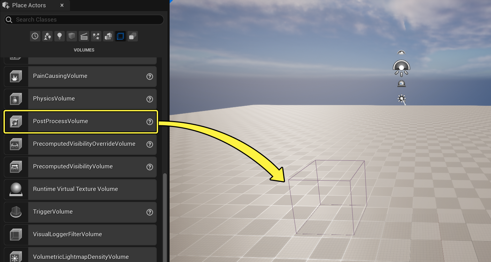
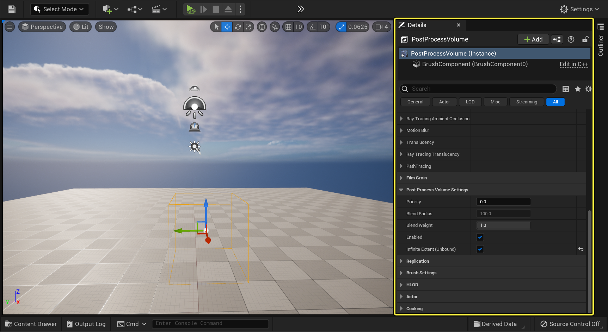
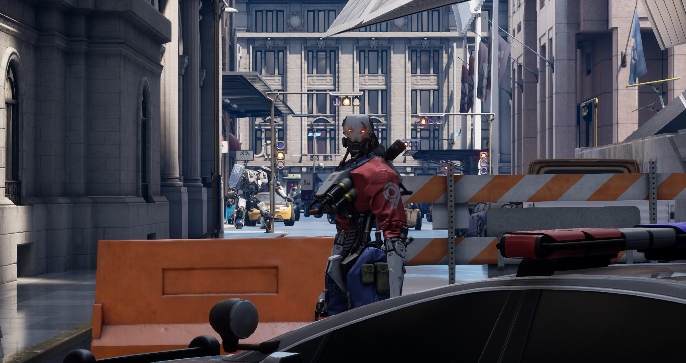

后期处理效果（Post-processing effect）使美术师和设计师能够对影响颜色、色调映射、光照的属性和功能进行组合选择，从而定义场景的整体外观。要访问这些功能，可以将一种称为 后期处理体积（Post Process Volume） 的特殊类型的体积添加到关卡。可以放置多个体积来定义特定区域的外观，也可以将其设置为影响整个场景。

# 使用后期处理体积
可以使用 放置Actor（Place Actors） 面板将一个 后期处理体积 添加到关卡。

放置到关卡中后，可以使用 细节（Details） 面板访问所有可用的属性和功能。你会发现后期处理体积根据它们的功能类型和它们的影响分为多个类目。

后期处理体积设置（Post Process Volume Settings） 是这个已放置的体积的特定设置，以及该体积如何与场景以及可能与之重叠的任何其他后期处理体积进行交互。例如，可以选中 无限范围（Infinite Extent） 属性以使此后期处理体积影响场景中的所有位置，或者不选中该属性以仅影响特定区域。当多个体积发生重叠时，你可以控制这些体积如何相互交互以从一个体积混合到另一个体积，这在它们之间具有完全不同的外观时会很有用。

|属性|描述|
|---|---|
|优先级（Priority）|指定此体积的优先级。在体积重叠的情况下，具有最高优先级的体积会覆盖较低优先级的体积。如果两个或多个重叠的体积具有相同的优先级，则顺序是不明确的。|
|混合半径（Blend Radius）|设置用于混合的体积周围半径（采用世界单位）。例如，当步入一个体积时，体积内的外观可能与体积外的不同。混合半径会在体积周围创建一个过渡区域。|
|混合权重（Blend Weight）|体积属性的影响程度。值为1具有全部效果，而值为0则没有效果。|
|已启用（Enabled）|此体积是否影响后期处理。如果启用，体积的设置将用于混合。|
|无限范围（无边界）（Infinite Extent (Unbound)）|是否考虑体积的边界。如果启用，体积会影响整个场景，而不考虑其体积的边界。未启用时，体积仅在其边界范围内有效。|

# 后期处理功能和属性

通过选择放置在关卡中的一个后期处理体积来访问该体积的属性和设置。细节（Details） 面板将列出可用类目及其可用属性。

> 即使关卡中没有放置后期处理体积，虚幻引擎也会使用一些默认的后期处理设置。可以在 项目设置（Project Settings） 的 渲染（Rendering）> 默认设置（Default Settings） 分段中找到和配置这些默认的后期处理设置。
> 
> 在开始定义场景外观之前，配置这些选项有助于进行关卡编辑以稳定自动曝光或泛光。

## 镜头

镜头（Lens） 类目包含的属性和设置用于模拟摄像机镜头产生的常见真实世界效果。

### 景深

与真实的摄像机类似，景深（Depth of Field） 根据焦点前后的距离为场景应用模糊效果。该效果用于根据深度将观看者的注意力吸引到镜头中的特定主体上。它还可以增加一种美感，使渲染的图像看起来更像照片或胶片。

有两个可用的景深选项：
- [过场动画景深（Cinematic Depth of Field）](https://zentia.github.io/p/%E8%BF%87%E5%9C%BA%E5%8A%A8%E7%94%BB%E6%99%AF%E6%B7%B1/)用于桌面平台和游戏主机平台。它可以提供一种胶片视觉效果，其属性与真实摄像机上的属性一致。后期处理体积提供了一些设置，但主要应该使用过场动画摄像机Actor上的摄像机属性来控制景深。