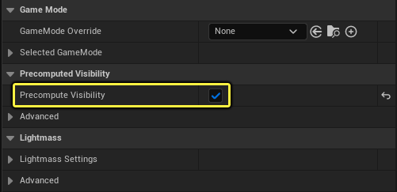

像其他剔除方法一样，预计算可视性体积用于实现中小型场景的性能优化，通常用于因为硬件问题而使动态遮挡剔除受到限制的移动平台。预计算可视性体积根据玩家或摄像机的位置，将Actor位置的可视性状态存储在场景中。因此，预计算可视性对于主要为静态点亮的环境项目、玩家运动受限和某些2D游戏区域最有用。

在照明构建期间，会在阴影投射几何体上方生成可视性单元格。Actor可视性从每个单元格位置存储。由于预计算可视性是在线下生成的，因此你省去的是通常用于硬件遮挡查询的渲染线程时间，但代价是会增加运行时内存和照明构建时间。基于这一点，建议仅在玩家或摄像机可访问区域放置体积来保持可视性剔除。

# 设置和用法
首先，需要为关卡启用预计算可视性。方法是打开世界场景设置（World Settings）并找到预计算可视性（Precomputed Visibility）部分。找到后，启用预计算可视性（Precomputed Visibility）旁边的复选框。

从模式（Modes）面板中，将预计算可视性