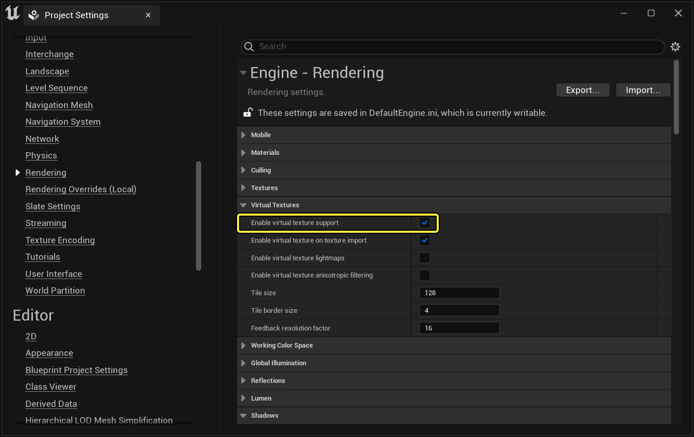
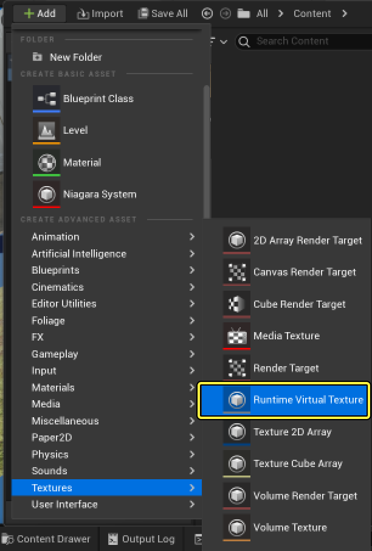
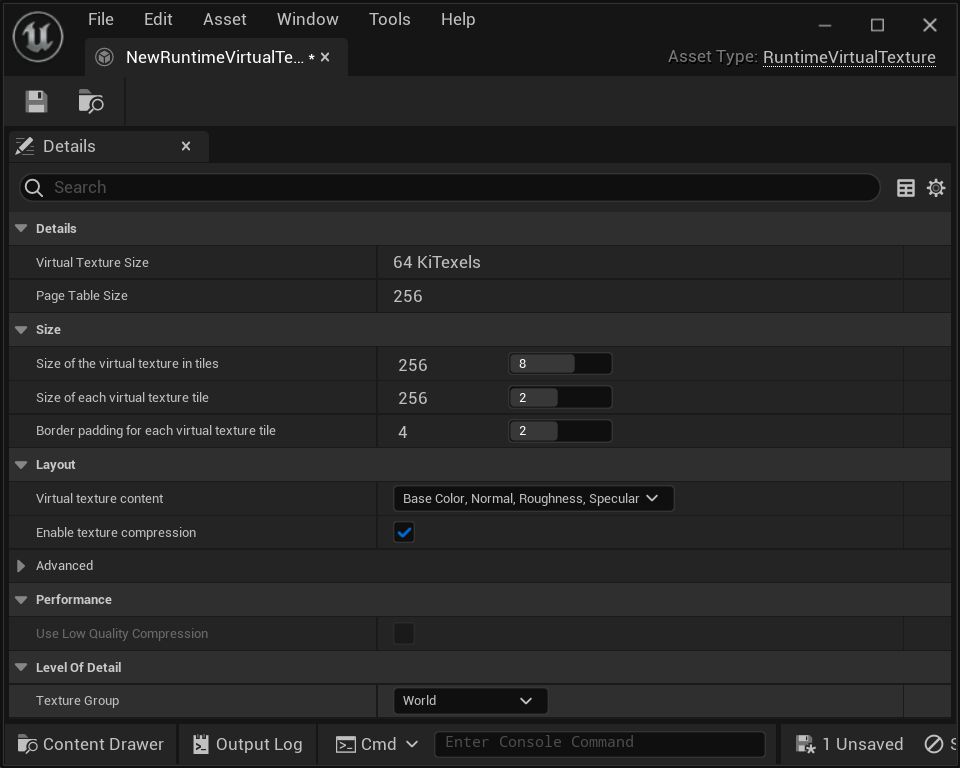

> 本指南要求使用了在Epic Games启动程序中示例选项卡下的内容示例项目中的材质。虽然不使用这些材质也可以完成以下步骤，但为了设置地形，使其正常生效，需要使用绘制好的地形材质。在继续前，打开 示例 选项卡下的内容示例项目 Landscapes 地图，以配合本指南的学习。

在运行时 虚拟纹理（RVT） 快速入门中，将介绍在你的项目中针对地形和非地形组件设置和使用RVT的过程。

在开始本指南前，出于以下原因，理解运行时虚拟纹理最适用于地形十分重要：

- 复杂的地形材质缓存着色效果，可提高性能。
- 使用样条型和贴花类效果可提高质量和加强变体。
- 由同一RVT资产处理非地形Acor与地形的混合。

完成本指南后，你会更了解：

- 设置运行时虚拟纹理资产以及它连接到不同组件的方式。
- 为地形材质启用运行时虚拟纹理。
- 在关卡中设置运行时虚拟纹理体积。
- 设置更多Actor以渲染至运行时虚拟纹理。

# 项目设置

使用运行时虚拟纹理前，必须先为项目启用它。执行以下步骤：

1. 在主菜单中，选择 编辑（Edit） 菜单并选择 项目设置（Project Settings）。在 引擎（Engine） > 渲染（Rendering） > 虚拟纹理（Virtual Textures） 类目下，将 启用虚拟纹理支持（Enable Virtual texture support） 设为true。

2. 重启 项目。

# 创建运行时虚拟纹理资产

运行时虚拟纹理 资产包含指定给运行时虚拟纹理体积的RVT资产的配置详情。RVT资产的工作原理是链接场景中需共享数据的材质和其他Actor。

1. 在 内容侧滑菜单 中，利用右键点击快捷菜单或 添加（+Add） 按钮从 纹理（Textures） 类目创建 运行时虚拟纹理 资产。

2. 为 运行时虚拟纹理 资产命名。在本指南中，命名为 VT_Test。
3. 双击打开此 运行时虚拟纹理 资产编辑器，以配置其可用属性。

在此窗口中，你可以定义运行时虚拟纹理（RSV）支持的大小、图块大小和材质属性类型。这些熟悉可以实时调整，并在编辑器中实时查看改动效果。

> 欲知这些设置的详情和用途，参阅虚拟纹理设置页面。