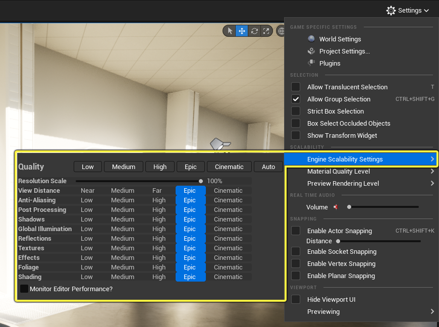
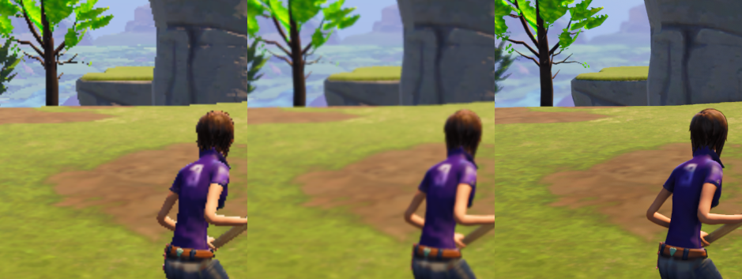
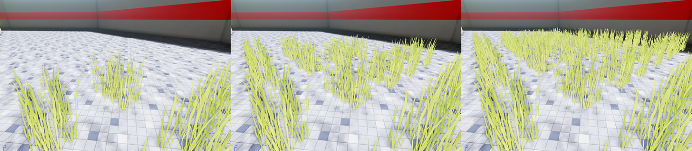
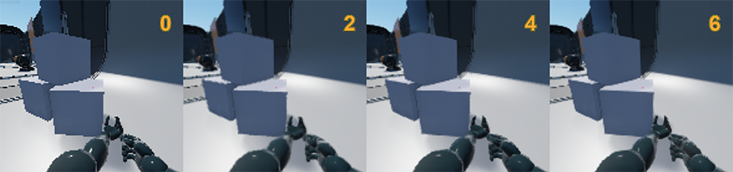

# 可延展性设置
要在编辑器中访问可延展性设置，可使用工具栏中的设置（Settings）菜单。

# 分辨率缩放
UE可以较低分辨率渲染场景，然后将图像延展到目标分辨率。

# 视图距离
对象可以根据与查看者的距离而剔除。默认情况下，所有对象都不会随距离而剔除（所需最大绘制距离为0）。除了设计者指定的值之外，还有一个全局可延展性设置，其作用类似于乘数（r.ViewDistanceScale）。下图您可以看到一些草对象（所需最大绘制距离为1000）：

# 抗锯齿

# 后期处理——sg.PostProcessQuality

# 阴影——sg.ShadowQuality

视图（View）->引擎可延展性设置（Engine Scalability Settings）->阴影（Shadows） 选项根据[UE_InstallPath]/Engine/Config文件夹中 BaseScalability.ini 文件中的设置，调节动态阴影的质量。低（Low） 设置等于 sg.ShadowQuality 0，Epic 等于 sg.ShadowQuality 3。

|sg.ShadowQuality 0             |sg.ShadowQuality 1                 |sg.ShadowQuality 2                 |sg.ShadowQuality 3                 |
|--                             |--                                 |--                                 |--                                 |
|r.LightFunctionQuality=0       |r.LightFunctionQuality=1           |r.LightFunctionQuality=1           |r.LightFunctionQuality=1           |
|r.ShadowQuality=0              |r.ShadowQuality=2                  |r.ShadowQuality=5                  |r.ShadowQuality=5                  |
|r.Shadow.CSM.MaxCascades=1     |r.Shadow.CSM.MaxCascades=1         |r.Shadow.CSM.MaxCascades=2         |r.Shadow.CSM.MaxCascades=4         |
|r.Shadow.MaxResolution=512     |r.Shadow.MaxResolution=1024        |r.Shadow.MaxResolution=1024        |r.Shadow.MaxResolution=1024        |
|r.Shadow.RadiusThreshold=0.06  |r.Shadow.RadiusThreshold=0.05      |r.Shadow.RadiusThreshold=0.03      |r.Shadow.RadiusThreshold=0.03      |
|r.Shadow.DistanceScale=0.6     |r.Shadow.DistanceScale=0.7         |r.Shadow.DistanceScale=0.85        |r.Shadow.DistanceScale=1.0         |
|r.Shadow.CSM.TransitionScale=0 |r.Shadow.CSM.TransitionScale=0.25  |r.Shadow.CSM.TransitionScale=0.8   |r.Shadow.CSM.TransitionScale=1.0   |

# 纹理——sg.TextureQuality
主流渲染引擎需要更多GPU内存（纹理、网格体、GBuffer、深度缓冲、阴影贴图）。其中一些根据屏幕分辨率缩放（例如GBuffer），另一些有特定的质量设置（例如，阴影贴图）。使用大量GPU内存的另一个因素是所用的纹理（通常压缩并流送）。您可以指示流送系统在管理上更主动一些（缩小池大小、剔除不用的纹理），或者在mip等级计算中拥有更少或更多细节。这样会影响图像质量、您能够注意到的纹理流送瑕疵数量以及游戏的运行流畅度（更新需要高成本内存传输）。结果不尽相同，具体取决于介质（例如，更快/更慢的硬盘/SSD）。从DVD/蓝光流送会大幅增加延迟，因此应当尽量避免。
