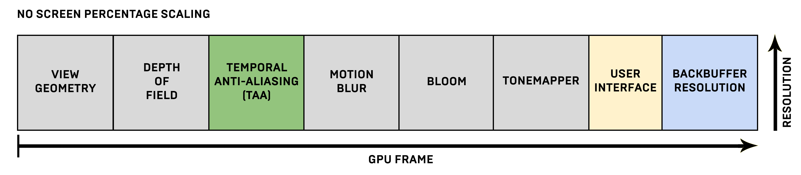
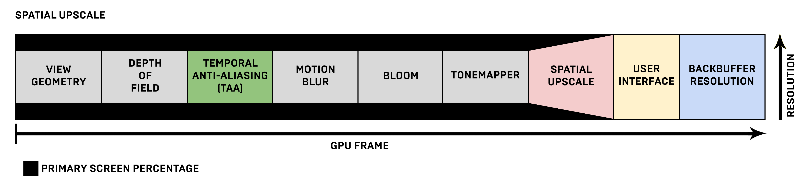
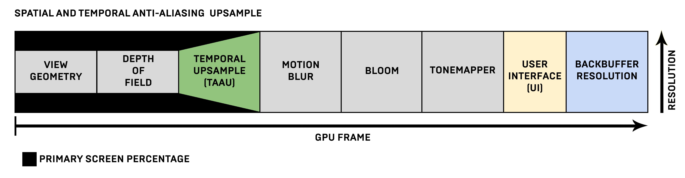
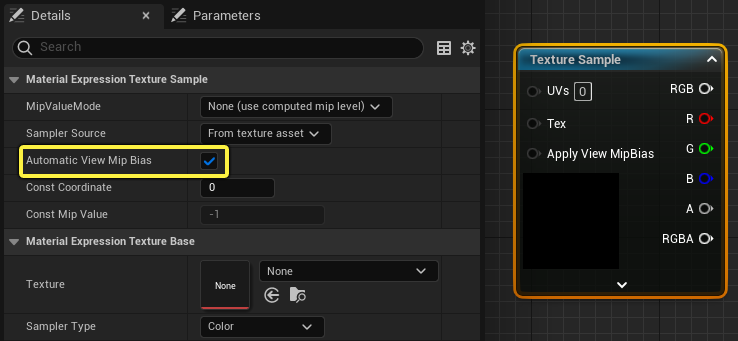
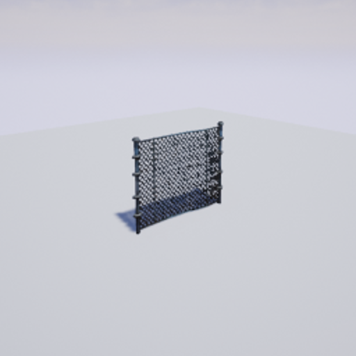
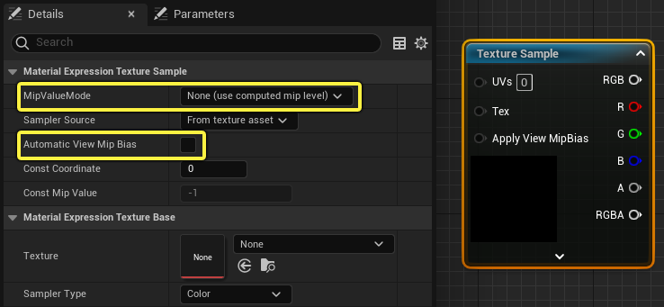

屏幕百分比 是一种分辨率调节技术，用于渲染分辨率低于或高于实际显示图像的图像。通过调节屏幕百分比，你的游戏可以在性能和图像分辨率之间保持平衡。

在虚幻引擎4（UE4）4.19版之前，你只需要更改屏幕百分比，但现在它分成了渲染管道中的两类缩放：主要和次要空间放大。
- 主要空间放大（Primary Spatial Upscaling） 就是以前使用的屏幕百分比功能。它的基本理念是以较低的分辨率渲染画面，然后先放大，再绘制用户界面（UI）。
- 次要空间放大（Secondary Spatial Upscaling） 执行第二次也是最终的空间放大传递，与主要放大传递无关。

# 主要屏幕百分比

主要空间放大（即主要屏幕百分比）的工作方式是按屏幕百分比渲染屏幕分辨率，然后进行缩放以适应你的当前屏幕分辨率。如果使用较低的屏幕百分比（或较低的分辨率），然后放大，就称为上采样。或者，在屏幕百分比增大之后（按较高的分辨率渲染），会缩小到当前屏幕的分辨率，这称为 超级取样。这一切都发生在绘制用户界面（UI）之前，可能对性能产生影响。

关于屏幕分辨率如何对组成屏幕上所渲染图像的所有缓冲区渲染目标起作用并使其组成一个GPU帧的概念，可以作如下说明：



对于每个GPU帧，所有渲染目标在管道中自始至终使用其全分辨率。



在使用空间放大的情况下，在UI之前绘制的一切都根据所用的屏幕百分比使用或高或低的分辨率。屏幕百分比已经降低（从UI之前变窄的渲染目标可以看出），为渲染目标产生了降低分辨率的图像。空间缩放发生在UI之前，将图像缩放至将要输出的屏幕分辨率。例如，如果当前分辨率设置为1920x1080，并且使用83%的屏幕分辨率，那么渲染目标的大小将调整为近似的1600x900分辨率，然后重新放大到1920x1080。

## 空间放大质量

在放大渲染目标时，可以使用以下控制台变量定义放大质量：

```
r.Upscale.Quality
```

它控制屏幕百分比和全屏窗口模式缩放3D渲染的质量

|上采样质量数值|上采样结果|
|-- |--            |
|0  |最接近的过滤   |
|1  |简单双线       |
|2  |定向模糊，带有非锐化遮罩上采样|
|3  |5-tap Catmull-Rom双立方插值，近似Lanczos 2（默认）|
|4  |13-tap Lanczos 3|
|5  |36-tap高斯过滤非锐化遮罩（成本非常高，但很适合极端上采样）|

或者，你可以使用下列控制台变量来控制如何处理色调映射器传递：

```
r.Tonemapper.MergeWithUpscale.Mode
```

色调映射器集成了一个简单的颜色空间空间放大，可以因为性能原因而使用值 1 来启用它。但是，如果材质后期处理在色调映射器之后插入，那么色调映射器就不会执行放大。它将重新使用主要空间放大，就像被禁用了一样。

# 时序抗锯齿上采样

除了主要空间放大外，主要屏幕分辨率还支持第二种放大技术：时序上采样。在时序抗锯齿上采样（TAAU）中，不是先使用时序抗锯齿（TAA）执行临时集成，然后再执行主要空间放大，实际上这两者是同时发生的。它们也可以收敛为比仅使用空间放大时更锐利的图像，不过这样做的成本也会比较高，因为要在较高的分辨率下运行更多后期处理。动态分辨率还可以隐藏主要屏幕百分比更改，从而更频繁地进行更改，尽可能接近地匹配GPU预算。



应该注意的是，在使用时序上采样时，不同的后期处理顺序不会因为增加TAAU而改变，因为它只是取代了TAA。真正的差别是，在TAAU之前进行的所有处理都将先使用较低的分辨率，然后上采样到TAAU传递之后的分辨率。在4.19版之前，是假定后期处理中的分辨率始终不变。

> 在主要屏幕百分比降低后，到干净的全分辨率输出的收敛会改变。因此，一些原有的TAA瑕疵会变得更明显。例如在非常细的几何体上，锯齿可能成为问题，增加在降低主要屏幕百分比时丢失此几何体细节的概率。

## 启用时序上采样

要使用时序抗锯齿上采样，你需要进入"项目设置（Project Setting）"中找到 时序上采样（Temporal Upsampling），更简单的办法是使用下列控制台变量：

```
r.TemporalAA.Upsampling 1
```

如果使用空间放大的主要屏幕百分比较低，在降低分辨率时，可能丢失重要细节。例如，对于铁链栅栏或者车头的格栅，当使用时序抗锯齿时，可能在较远的距离比较难以看清细节。如果启用TAAU，就可以在仍然使用降低的屏幕百分比的情况下减少这一问题。

## Automatic View Texture Mip Bias

因为屏幕百分比会导致几何体以较低的像素密度渲染，所以时序上采样需要更多来自 表面 和 延迟贴花 材质域的纹理信息才能保持输出锐利度不变。为此，在默认情况下可以使用纹理取样表达式 Automatic View Mip Bias。

纹理取样表达式可使用 Automatic View Mip Bias 来切换是否应该通过逐视图的Mip偏差对纹理进行取样，从而使时序抗锯齿具有更锐利的输出。



对于高频纹理（例如下面的示例），自动Mip偏差在较低的屏幕百分比下可能问题较多。



在这种情况下，可以使用Mip偏差输入来补偿，或者选择不使用 Automatic View Mip Bias。



> Automatic View Mip Bias 仅发生在启用TAAU的情况下。常规抗锯齿方法（TAA、MSAA和FXAA）将无法使用此选项。

## 实现抗锯齿质量的着色器性能Permutation

和TAA一样，临时放大采样附带用于实现后期处理质量3和4的更快着色器Permutation。着色器Permutation换来的是一定的质量，能够在主机平台上发布60Hz运行的作品。质量设置与设置后期处理质量时已经使用的设置相似。此外还应牢记，TAAU需要比TAA更多的工作，因为它是在较高的分辨率下运行，并且在TAAU传递之后还有后期处理。

可以使用下列控制台变量调节后期处理质量：

```
r.PostProcessAAQuality
```

值得注意的是，时序上采样之后的后期处理是在全分辨率下运行的，所以禁用TAA将使它们在较低的分辨率下运行，这是因为它们将在最后进行空间放大，从而加快后期处理的速度。请使用命令profileGPU来调查每次传递中GPU性能的明细，使用的是什么传递，以及大部分预算用在哪里。

下表说明了使用这些范围中的主要屏幕百分比值设置时你可以期待的结果：

|屏幕范围|百分比|备注|
|--     |--     |--|
|50%    |71%    |这是提高性能的最快方法，因为它在内存中使用较小的本地数据存储（LDS）块。如果目标是在台式机和游戏机上时序上采样到4K，这是理想的选择。|
|71%    |100%   |对于台式机和游戏机上的普通DPI（每英寸点数）渲染是理想选择。|
|100%   |200%   |如果要使动态分辨率在不被用于渲染目标的GPU内存限制的前提下具有超过100%的理论可能，那么这是理想选择。|