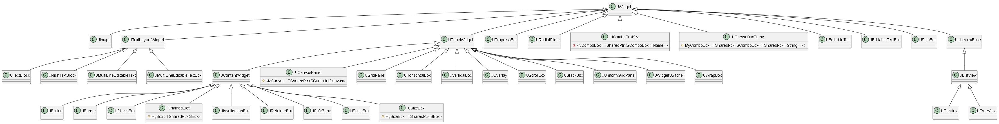
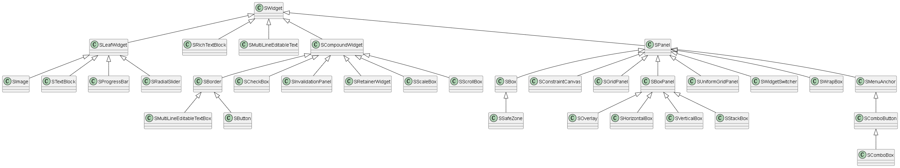
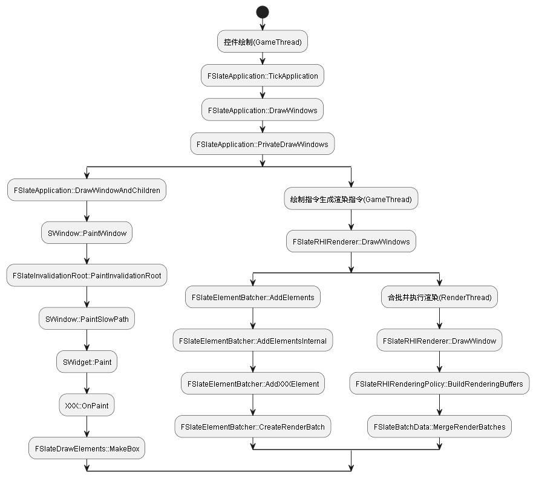

# 初衷
Slate的初衷来自对现有可用UI解决方案的审视。部分结论如下：
- 在多数工具包中从控件构建UI已非难处。而难处在于：
    - UI设计和迭代。
    - 控制数据流：通常视为控件（视图）和基层数据（模型）之间的绑定。
    - 学习描述UI的其他语言。
- IMGUI：直接模式图形用户界面
    - 优点：
        - 程序喜欢UI描述“接近”代码，易于获取数据。
        - 失效不会成为问题，直接轮询查询数据即可。
        - 易于程序化构建界面。
    - 缺点：
        - 添加动画和设计较难。
        - UI描述为命令式代码，因此无法将其设为数据驱动。

- Unreal的UI系统由Slate和UMG两部分组成，它们的关系与SWidget和UWidget相同
- SWidget在SlateCore中，控件的绘制、点击以及大部分控件逻辑都集中在这里面。
- UWidget是对SWidget的一个包装
- UWidget本身是基于UObject，不包括太多空间逻辑，主要作用是，加入了UObject的GC系统，支持反射和蓝图





# UI绘制流程

Slate在CPU中执行的逻辑分为以下三大块


第一块是控件绘制，在主线程中，给每个控件分配LayerId，并从控件抽象出`FSlateDrawElement`。

第二块是绘制指令生成渲染命令，也是在主线程中，把`FSlateDrawElement`包装成`FSlateRenderBatch`，并根据控件的信息生成VerterBuffer。

第三块是合批执行渲染，在渲染线程，把之前生成`FSlateRenderBatch`按照LayerId从小到大排序，并尝试合批。最后把UI渲染到BackBuffer。

# 控件绘制

整个控件绘制过程，实际上是一个递归调用，所以Unreal的UI绘制时一个深度优先的遍历。递归过程如下：

1. SWindow调用`SWidget::Paint`
2. 执行`SWidget::Paint`，并调用纯虚函数`OnPaint`，分发给各个控件实现的`OnPaint`。
3. 执行各个控件的`OnPaint`，完成绘制，如果包含子控件则调用子控件的`Paint`，回到第二步。
4. 直到把所有控件绘制完

# 控件对LayerId的影响

大部分控件都是使用参数中的LayerId，不会改变LayerId。一个控件对LayerId的影响，可以分为自身逻辑和基类影响两部分。

Slate控件的基类主要是下面这四类
1. SWidget是所有控件的基类，不改变LayerId
2. SLeafWidget不包含子控件，不改变LayerId
3. SCompoundWidget包含一个子空间，它会使子空间的LayerId + 1
4. SPanel包含多个子空间，不改变LayerId，所有子控件都继承父控件的LayerId。

# 绘制只能怪生成渲染指令

在每个控件OnPaint的最后i，如果有需要绘制的内容。会调用`FSlateDrawElement::MakeXXX`，吧控件的绘制抽象成一个`FSlateDrawElement`。这里设置的`EElementType`

# MergeRenderBatches
在UI绘制的最后，会进入渲染线程，进行渲染指令的合批和渲染。在合批的一开始，就会对多少有的`FSlateRenderBatch`根据LayerId，从小到大排序

LayerId不同，不能合批

```c++
bool IsBatchableWith(const FSlateRenderBatch& Other) const
{
	return
		ShaderResource == Other.ShaderResource
		&& DrawFlags == Other.DrawFlags
		&& ShaderType == Other.ShaderType
		&& DrawPrimitiveType == Other.DrawPrimitiveType
		&& DrawEffects == Other.DrawEffects
		&& ShaderParams == Other.ShaderParams
		&& InstanceData == Other.InstanceData
		&& InstanceCount == Other.InstanceCount
		&& InstanceOffset == Other.InstanceOffset
		&& DynamicOffset == Other.DynamicOffset
		&& CustomDrawer == Other.CustomDrawer
		&& SceneIndex == Other.SceneIndex
		&& ClippingState == Other.ClippingState;
}
```

# 优化建议

总结一下上面刨析的UE合批机制，影响合批的主要是以下几个因素：

1. LayerId
2. ShaderResource，图片或图集不同的Image控件不能合批。
3. Tiling，设置了Tiling的控件不能和普通控件合批。
4. ShaderType， DrawAs选了Border和文本控件，不能和普通控件合批。
5. DrawEffects，自己和父控件不能去掉`IsEnable`
6. ShaderParams，DarwAs选了Border的控件，不能和普通控件合批

其实不用太在意合批，原因是：
# 合批很难
# 合批提升不大
# DrawCall不再是瓶颈
使用RetainerBox来实现动静分离，降低OverDraw

# HittestGrid点击机制刨析

HittestGrid是以Window为单位进行划分的，一整个编辑器界面既是一个Window。默认情况下HittestGrid把一个Window按照区块（即Cell）128*128大小，划分为多个Cell。

每个Cell存储了和该Cell相交的控件，以加速查询过程。所以往往一个控件会被多个Cell所持有，等到真正相应点击的时候，还会用控件和鼠标做一次包含判断，Cell划分只是一种加速算法。