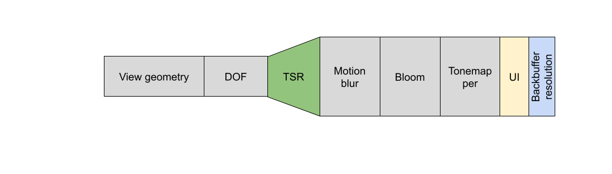

时序上采样器（Temporal Upscalers） 使用来自当前和之前帧的数据来产生高质量的增强结果。 无论是虚幻引擎4的Temporal Anti-Aliasing Upscaling (TAAU)、虚幻引擎5的Temporal Super Resolution，还是诸如NVIDIA的DLSS 2+ Super Resolution、AMD的FSR 2.0+和Intel的XeSS等第三方插件，时序上采样器都在虚幻引擎里以相同方式运作。它们都在同一位置插入后期处理链--在景深和动态模糊之间。

无论使用哪种时序上采样器，渲染分辨率都是由Screen Percentage，或在支持时同时由Dynamic Resolution来控制。