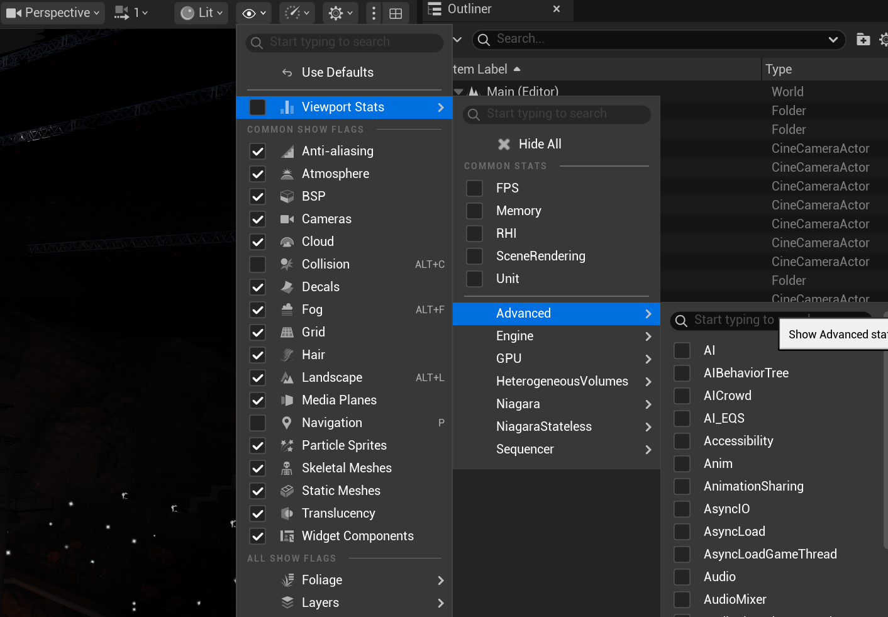

# [PSO缓存](https://dev.epicgames.com/documentation/zh-cn/unreal-engine/optimizing-rendering-with-pso-caches-in-unreal-engine)
早期的图形API（如Direct3D11），在发出绘制调用之前，需要进行数十次单独调用，以便动态配置GPU参数。更多最新的图形API（如Direct3D12、Vulkan和Metal）支持使用名为管线状态对象（PSO）的预配置GPU状态信息包，可以更快速地更改GPU状态。

尽管这样可大幅提升渲染效率，但按需生成新PSO可能需要100毫秒或更久，因为应用程序必须配置所有可能的参数。因此，为提升效率，必须在需要使用PSO之前提前很久生成PSO。

# [Stat命令](https://dev.epicgames.com/documentation/zh-cn/unreal-engine/stat-commands-in-unreal-engine)



## Stat命令表
输入`stat`和一个空格，然后输入以下命令，从而激活它们：

| 命令名称   | 命令说明     |
| --------  | -------- |
| Anim | 显示每次tick蒙皮网格体需要多长时间进行计算。 |
| AsyncLoad / AsyncLoadGameThread | 显示异步加载的性能统计数据。|
| Canvas | 画布统计数据，显示画布用户界面项（例如图块、边框和文本）的性能信息。|
| Component | 显示组件列表及组件性能信息。|
| Compression | 显示压缩统计数据。|
| CPULoad | 显示GPU利用率 |
| StartFile | 启动统计数据采集，同时在分析目录中创建一个新文件。|
| StatSystem | 显示统计系统的性能和内存信息。|
| StopFile | 完成由stat StartFile启动的统计数据采集，同时关闭在分析目录中创建的文件。|

# [Unreal Insights](https://dev.epicgames.com/documentation/zh-cn/unreal-engine/unreal-insights-in-unreal-engine)

# [低级别测试](https://dev.epicgames.com/documentation/zh-cn/unreal-engine/low-level-tests-in-unreal-engine)

# [可视记录器]
控制台命令`VisLog`

# [Clang检测工具](https://dev.epicgames.com/documentation/zh-cn/unreal-engine/using-clang-sanitizers-in-unreal-engine-projects)
很多编程错误并不违反C++的句法，所以在编译的时候不会被编译器发现。然而即使句法是正确的，逻辑中的漏洞也会导致严重的问题，比如：
- 内存泄漏
- 竞争条件
- 未初始化的内存
- 数组中越界访问
- 整数溢出

```
Build\BatchFiles\Build.bat MyGame Linux Development -WaitMutex -FromMsBuild -EnableASan
```

## 受支持的检测工具

| 检测工具   | UBT指令     |描述|
| --------  | -------- | -------- |
| Address Sanitizer (ASan) | -EnableASan | 检测多种内存访问的问题，包括越界访问和内存泄漏。功能自Android 14后废弃。 |

# [自动化系统概述](https://dev.epicgames.com/documentation/zh-cn/unreal-engine/automation-test-framework-in-unreal-engine)