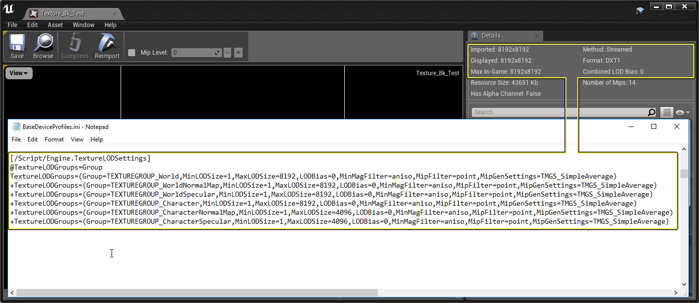

在任何数字项目内存占用比例中，最大的一个内存占用来源是所用的纹理大小和数量。幸运的是，虚幻引擎 拥有非常可靠的系统，能够以非破坏性方式减小所有项目纹理的纹理大小。在以下页面中，我们将介绍这些系统，以及如何使用它们来降低项目纹理内存要求。

# 纹理分辨率

虚幻引擎支持1x1到8192x8192的纹理分辨率，只需要对.INI文件进行少许修改。最新的DirectX视频适配器和游戏主机支持1x1到2048x2048的各种纹理分辨率，最高可达8192x8192。特定硬件设备支持的最高纹理分辨率因制造商、型号和可用纹理内存而异。虚幻引擎4中有一些功能和设置，用于管理针对各种区域渲染的纹理分辨率，如场景几何结构或用户界面。

# 引擎纹理分辨率限制
虚幻引擎4默认将最大纹理mip数量限制为14，这样有效地将最大渲染纹理限制为8192（1x1到8192x8192为14个mip）。

这有一种副作用，即导入的8192纹理将仅渲染4096中的mip1。恒定值MAX_TEXTURE_MIP_COUNT在引擎源文件中默认为13，可以修改为值14以支持8192纹理渲染。该恒定值在以下源文件中定义（截至QAMar09，确保在其他QA版本上验证）。

从发布UE 4.8开始，您现在可以修改项目以使用高达8192的大小，而不必修改C++代码，只需在项目的 BaseDeviceProfiles.ini 文件中添加以下文本并将 MaxLODsize 设置为 8192 即可

```
[/Script/Engine.TextureLODSettings]
TextureLODGroup_World=(MinLODSize=1,MaxLODSize=8192,LODBias=0,MinMagFilter=aniso,MipFilter=point)
```

添加了想要增加其大小的分段后，保存文件并重新启动编辑器。编辑器重新启动后，以8192大小导入的任何纹理现在应该在LOD 1显示大小8192，而不是限制在最大值4096以内。在以下示例图像中，我们修改了UE 4.8项目中的BaseDeviceProfiles.ini文件，以允许使用大小高达8192的纹理。在UE4中加载纹理Texture_8k_Test时，我们可以看到导入和显示的纹理大小均为8192。



# 压缩的纹理内存要求

DXT使用有损压缩，通过调色板颜色和插值颜色将像素压缩在4x4的块中。这样会产生8:1 DXT1和4:1 DXT5恒定压缩文件大小。由于特定平台和硬件的视频内存和纹理池资源是固定的，因此纹理分辨率和资源使用必须达到平衡。下表列出了各种常见分辨率和完全mip下，DXT1和DXT5的纹理内存要求（1x1到完全原生mip0）。请注意，内存要求几乎是纹理分辨率比例的倍数不变，DXT5纹理对内存的占用几乎是DXT1的两倍。

由于分辨率与压缩的比值是常量，为了计算本文未列出的纹理的内存要求，只需乘以分辨率比例即可。例如，1024x512纹理的内存要求是1024x1024纹理的一半。

下表数据是根据使用箱式过滤器mip生成和DirectX纹理压缩，由ATI的Compressonator创建的纹理编译的。

|分辨率|来自1x1的总Mip	|DXT1|DXT5|
|--|--|--|--|
|16x16|5个mip|312字节|496字节|
|8192x8192|14个mip|42.6MB（44,739,384字节）|85.3MB（89,478,640字节）|

# 引擎配置TextureGroup属性

特定游戏的TextureGroup支持的最低和最高LOD（mip）在多个引擎配置文件中定义。
源配置设置文件组位于`[虚幻引擎4安装位置]\Engine\Config\BaseDeviceProfiles.ini` 文件的[/Scripts/Engine.TextureLODSettings]分段中。

为开发游戏，[your_game]\Config\DefaultDeviceProfiles.ini 文件还在 Engine\Config\ 文件夹中包含一组镜像基础文件，这应当是通常根据游戏特定设置进行修改的副本。

需要注意的是，虚幻编辑器和游戏中拥有一组独立的TextureGroup条目。这两组分别位于配置文件的[SystemSettingsEditor]和[SystemSettings]分段中。

DefaultDeviceProfiles.ini 文件中的TextureLODGroup设置条目类与此类似。请注意，较早QA版本可能不包含各个设置的MinMagFilter和MipFilter属性。

```
[/Script/Engine.TextureLODSettings]
; 请注意，该分段中的任何项目会影响所有平台！！！
@TextureLODGroups=Group
TextureLODGroups=(Group=TEXTUREGROUP_World,MinLODSize=1,MaxLODSize=4096,LODBias=0,MinMagFilter=aniso,MipFilter=point,MipGenSettings=TMGS_SimpleAverage)
+TextureLODGroups=(Group=TEXTUREGROUP_WorldNormalMap,MinLODSize=1,MaxLODSize=4096,LODBias=0,MinMagFilter=aniso,MipFilter=point,MipGenSettings=TMGS_SimpleAverage)
+TextureLODGroups=(Group=TEXTUREGROUP_WorldSpecular,MinLODSize=1,MaxLODSize=4096,LODBias=0,MinMagFilter=aniso,MipFilter=point,MipGenSettings=TMGS_SimpleAverage)
+TextureLODGroups=(Group=TEXTUREGROUP_Character,MinLODSize=1,MaxLODSize=4096,LODBias=0,MinMagFilter=aniso,MipFilter=point,MipGenSettings=TMGS_SimpleAverage)
+TextureLODGroups=(Group=TEXTUREGROUP_CharacterNormalMap,MinLODSize=1,MaxLODSize=4096,LODBias=0,MinMagFilter=aniso,MipFilter=point,MipGenSettings=TMGS_SimpleAverage)
+TextureLODGroups=(Group=TEXTUREGROUP_CharacterSpecular,MinLODSize=1,MaxLODSize=4096,LODBias=0,MinMagFilter=aniso,MipFilter=point,MipGenSettings=TMGS_SimpleAverage)
+TextureLODGroups=(Group=TEXTUREGROUP_Weapon,MinLODSize=1,MaxLODSize=4096,LODBias=0,MinMagFilter=aniso,MipFilter=point,MipGenSettings=TMGS_SimpleAverage)
+TextureLODGroups=(Group=TEXTUREGROUP_WeaponNormalMap,MinLODSize=1,MaxLODSize=4096,LODBias=0,MinMagFilter=aniso,MipFilter=point,MipGenSettings=TMGS_SimpleAverage)
+TextureLODGroups=(Group=TEXTUREGROUP_WeaponSpecular,MinLODSize=1,MaxLODSize=4096,LODBias=0,MinMagFilter=aniso,MipFilter=point,MipGenSettings=TMGS_SimpleAverage)
+TextureLODGroups=(Group=TEXTUREGROUP_Vehicle,MinLODSize=1,MaxLODSize=4096,LODBias=0,MinMagFilter=aniso,MipFilter=point,MipGenSettings=TMGS_SimpleAverage)
+TextureLODGroups=(Group=TEXTUREGROUP_VehicleNormalMap,MinLODSize=1,MaxLODSize=4096,LODBias=0,MinMagFilter=aniso,MipFilter=point,MipGenSettings=TMGS_SimpleAverage)
+TextureLODGroups=(Group=TEXTUREGROUP_VehicleSpecular,MinLODSize=1,MaxLODSize=4096,LODBias=0,MinMagFilter=aniso,MipFilter=point,MipGenSettings=TMGS_SimpleAverage)
+TextureLODGroups=(Group=TEXTUREGROUP_Cinematic,MinLODSize=1,MaxLODSize=4096,LODBias=0,MinMagFilter=aniso,MipFilter=point,MipGenSettings=TMGS_SimpleAverage)
+TextureLODGroups=(Group=TEXTUREGROUP_Effects,MinLODSize=1,MaxLODSize=4096,LODBias=0,MinMagFilter=linear,MipFilter=point,MipGenSettings=TMGS_SimpleAverage)
+TextureLODGroups=(Group=TEXTUREGROUP_EffectsNotFiltered,MinLODSize=1,MaxLODSize=4096,LODBias=0,MinMagFilter=aniso,MipFilter=point,MipGenSettings=TMGS_SimpleAverage)
+TextureLODGroups=(Group=TEXTUREGROUP_Skybox,MinLODSize=1,MaxLODSize=4096,LODBias=0,MinMagFilter=aniso,MipFilter=point,MipGenSettings=TMGS_SimpleAverage)
+TextureLODGroups=(Group=TEXTUREGROUP_UI,MinLODSize=1,MaxLODSize=4096,LODBias=0,MinMagFilter=aniso,MipFilter=point,MipGenSettings=TMGS_SimpleAverage)
+TextureLODGroups=(Group=TEXTUREGROUP_Lightmap,MinLODSize=1,MaxLODSize=4096,LODBias=0,MinMagFilter=aniso,MipFilter=point,MipGenSettings=TMGS_SimpleAverage)
+TextureLODGroups=(Group=TEXTUREGROUP_Shadowmap,MinLODSize=1,MaxLODSize=4096,LODBias=0,MinMagFilter=aniso,MipFilter=point,NumStreamedMips=3,MipGenSettings=TMGS_SimpleAverage)
+TextureLODGroups=(Group=TEXTUREGROUP_RenderTarget,MinLODSize=1,MaxLODSize=4096,LODBias=0,MinMagFilter=aniso,MipFilter=point,MipGenSettings=TMGS_SimpleAverage)
+TextureLODGroups=(Group=TEXTUREGROUP_MobileFlattened,MinLODSize=1,MaxLODSize=4096,LODBias=0,MinMagFilter=aniso,MipFilter=point,MipGenSettings=TMGS_SimpleAverage)
+TextureLODGroups=(Group=TEXTUREGROUP_Terrain_Heightmap,MinLODSize=1,MaxLODSize=4096,LODBias=0,MinMagFilter=aniso,MipFilter=point,MipGenSettings=TMGS_SimpleAverage)
+TextureLODGroups=(Group=TEXTUREGROUP_Terrain_Weightmap,MinLODSize=1,MaxLODSize=4096,LODBias=0,MinMagFilter=aniso,MipFilter=point,MipGenSettings=TMGS_SimpleAverage)
+TextureLODGroups=(Group=TEXTUREGROUP_Bokeh,MinLODSize=1,MaxLODSize=256,LODBias=0,MinMagFilter=linear,MipFilter=linear,MipGenSettings=TMGS_SimpleAverage)
+TextureLODGroups=(Group=TEXTUREGROUP_Pixels2D,MinLODSize=1,MaxLODSize=4096,LODBias=0,MinMagFilter=point,MipFilter=point,MipGenSettings=TMGS_SimpleAverage)
```

# PC AppCompat桶

AppCompat用于根据目标和启动时收集的经验证据来覆盖各种SystemSettings。启用应用兼容性（仅限PC）时，系统衡量机器能力，然后使用五个"桶"中的其中一个桶的预设值来覆盖Engine.ini值。请参阅Engine\Config\文件夹中的BaseCompat.ini以了解相关用法示例。

AppCompat应该仅在首次运行游戏（而不是编辑器）时检查一次。它通过在[game]Engine.ini中检查是否存在[AppCompat]分段来进行检测，这个分段包含机器先前计算的分数。如果AppCompat已经应用过一次，则不会再次更改以允许用户每次在不进行覆盖的情况下进行自定义更改。

AppCompat专门针对编辑器禁用，这样机器规格不会影响开发期间在各种机器上查看资源的方式。因此，SystemSettings和SystemSettingsEditor才需要区分开来。

您可以有效地禁用AppCompat，方法是为游戏提供空的DefaultCompat.ini，使其从Engine.ini中的[SystemSettings]初始化所有桶。在此情况下，系统完全按照引入AppCompat之前的状态运行。

# TEXTUREGROUP属性

每个TextureGroup条目为游戏渲染中使用的特定纹理集定义纹理属性。通过将纹理分组为常用集，可以更好地控制各种游戏纹理资源的纹理内存池使用。

|属性|说明|
|--|--|
|MinLODSize|将渲染的最小mip大小，以像素为单位指定，范围1到8192中的2的幂值，必须小于MaxLODSize。|
|MaxLODSize|将渲染的最大mip大小，以像素为单位指定，范围1到8192中的2的幂值，必须大于MinLODSize。|

# 过滤
|MinMagFilter|MipFilter|过滤类型|
|--|--|--|
|点||点|
|各向异性||各向异性线性|

# TextureGroup、LODGroup和LODBias
配置ini文件中指定的TextureGroup和LODBias设置以及纹理属性中指定的LODGroup和LODBias设置确定了用于单个纹理的最终纹理mip集。

[your_game]Engine.ini中的示例TextureGroup条目可能类似于：

```
Group=TEXTUREGROUP_World,MinLODSize=1,MaxLODSize=4096,LODBias=0,MinMagFilter=aniso,MipFilter=point,MipGenSettings=TMGS_SimpleAverage
```

# 纹理属性
关于各种纹理属性的含义说明，请参阅纹理属性页面。