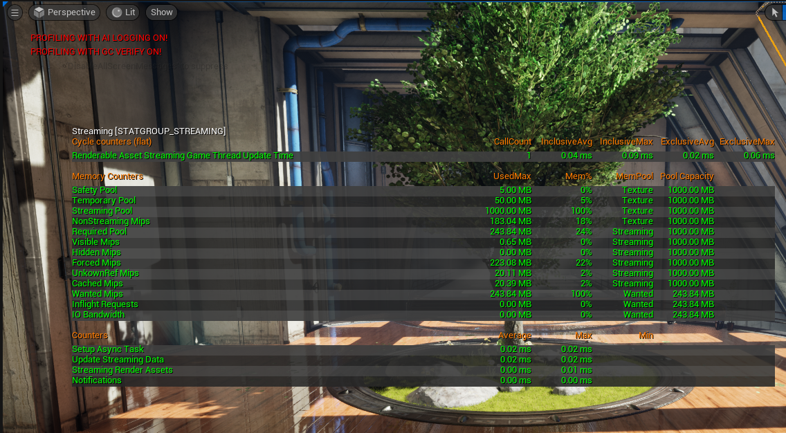

可使用 STAT STREAMING 控制台命令分析纹理流送状态。此分析报告性能、内存使用，以及纹理流送器使用的其他指标。

```
STAT STREAMING sortby=name maxhistoryframes=1
```



读取内存数据时，术语"pool"代表概念（保留）内存，与实际使用的内存无关。 术语"mips"代表纹理当前使用的内存，而非未发生或未来的使用。内存指标分为三种主要的池：

- Texture
- Streaming
- Wanted

> 这些池的大小显示在 Memory Counters 类目中每行的右方。

|数据|描述|
|--|--|
|Game Thread Update Time|流送器更新函数所占用的时间。这负责大多数的纹理流送工作。只有少数任务在纹理流送器外处理，如移除对纹理、组件或关卡的引用。在一个游戏线程更新中，流送器向完整更新执行一步。完成更新将持续数帧，并与 r.Streaming.FramesForFullUpdate 相关。如数据的 Counter 部分所定义，更新步骤各有不同。|
|Texture Pool|纹理资源可用的总内存。这包含各种非流送资源，如渲染目标、GPU 粒子缓存、立方体贴图、UI 纹理和不可流送纹理。在部分平台上，此内存可用于保存静态网格体之类的非纹理资源。Texture Pool 约等于 Safety Pool + Temporary Pool + Streaming Pool + NonStreaming Mips（如有，仅限波动的量，上至安全池的大小）|
|Safety Pool|此值在 Engine 配置文件中设置（在 [TextureStreaming] 下，作为 MemoryMargin）。这是为意外（非流送）分配预留的内存。如可用的内存因低于此值的量形成周期波动，纹理流送器将在此波动下最大程度地稳定其流送池如正常（预计）的波动超过安全池大小，纹理流送器将不断应用其预算，可能会创建流入和流出纹理的无限循环。|
|Temporary Pool|此值由 r.Streaming.MaxTempMemoryAllowed 控制，并指定调整纹理大小时流送器可用的额外内存量。变更纹理的 mip 数量时，引擎需要新建一个纹理（无论大小），用于保存之后的 mip 数据。这能间接控制进行中请求的数量，因为流送器将向 IO 系统发送临时池允许的请求数量。注意：临时池最小尺寸必须与需要流送的最大资源相同，但设为过大会浪费内存（因其正是为此目的而预留）。从另一方面而言，设为过小会减缓流送速度（无法为 IO 系统生成足够的工作，使其进入待机状态）。此外还需注意：流送器无法对进行中请求内的处理顺序进行较大程度的控制。这意味着使用相对较小的临时池可更大程度地控制加载顺序。|
|Streaming Pool|纹理流送器可用的内存量。流送器通常会将所有可用内存用于流送新 mip，或将之前流送的 mip 尽可能久地保存在内存中。流送池（Streaming Pool）包含可见 Mip（Visible Mip）、隐藏 Mip（Hidden Mip）、强制 Mip（Force Mip）和缓存 Mip（Cached Mip）。Streaming Pool 约等于 Visible Mips* + Hidden Mips + Forced Mips + Cached Mips（完全使用时为 *:，否则未使用的空间必须被占用）|
|NonStreaming Mips|非流送分配使用的内存量。如这些分配因超过安全池的值而出现定期波动，这将影响流送池的预算，应避免出现此状况（减少分配次数或增加安全池）。|
|Required Pool|纹理流送器需要根据其指标加载的 mip 数据量。这可超过纹理流送池的 100%，但同时也会进行一些妥协，部分纹理将不会以其所要求的分辨率加载。|
|Visible Mips|可见纹理 mip 当前占用的所需内存。这并不包含强制 mip。|
|Hidden Mips|非可见纹理 mip 当前占用的所需内存。这并不包含强制 mip。为防止首次显示纹理时出现低精度纹理，流送器会提前预流送纹理，但通常会比所需要的少一个 mip（详见 r.Streaming.HiddenPrimitiveScale）。|