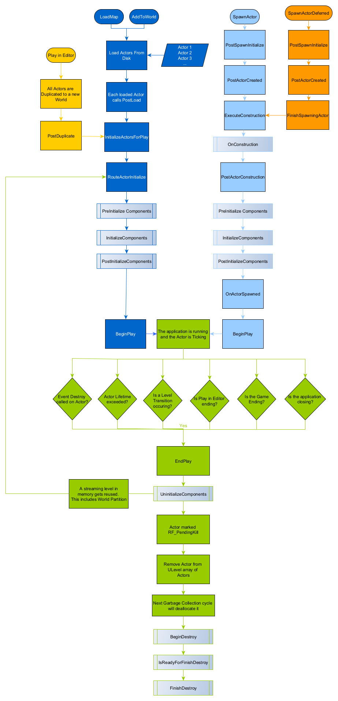

本文档大致介绍了Actor的生命周期，其中包括：
- 如何在关卡中实例化或生成Actor，包括如何初始化Actor。
- 如何将Actor标识为PendingKill，然后通过垃圾回收移除或销毁。
- 下方流程图展示了如何实例化Actor的主要路径。无论Actor是如何创建的，它们的销毁路径均相同。

# 生命周期详解

# 从磁盘加载

从磁盘加载（Load From Disk）路径适用于已经在关卡中的Actor，如当 UEngine::LoadMap 发生时，或当关卡流送调用 UWorld::AddToWorld 时。