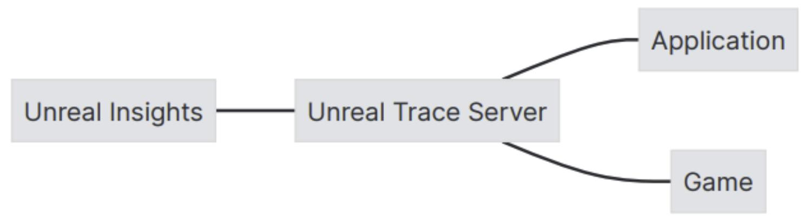

Unreal Insights是一个遥测捕获和分析套件，它可以从您的项目中以高数据率捕获事件。Unreal Insights可以帮你识别出可能需要优化的数据区域。

Unreal Insights的主要组成部分分为：
- Trace事件，包含了事件名称和字段名称参数，用于定义一个事件并指定事件应包括的字段。
- Unreal Trace Server，用于记录并保存来自应用程序的踪迹。
- Unreal Insights，对数据进行分析和可视化处理。

Trace会话是自描述的，并且与不同的引擎发布版本兼容。它们被存储在.utrace文件中。任何同时生成的数据都存储在与Trace文件相同目录下的.ucache文件中。