可以利用 查找表（LUT）来实现使用后期处理体积的颜色校正。 不要使用三个一维（1D）查找表，而应该使用一个三维（3D）查找表。 这样可以提供更精细的色彩变换，从而可用于去饱和度之类的用途。

虚幻引擎中使用的一种查找表是16x16x16的中性色调LUT，解压后为256x16的纹理。 这些示例显示了中性色调和棕褐色调的LUT。 如果要应用中性色调LUT，你将不会看到默认场景有任何变化，但是如果使用棕褐色调的LUT，就会看到类似于下图这样的情况：

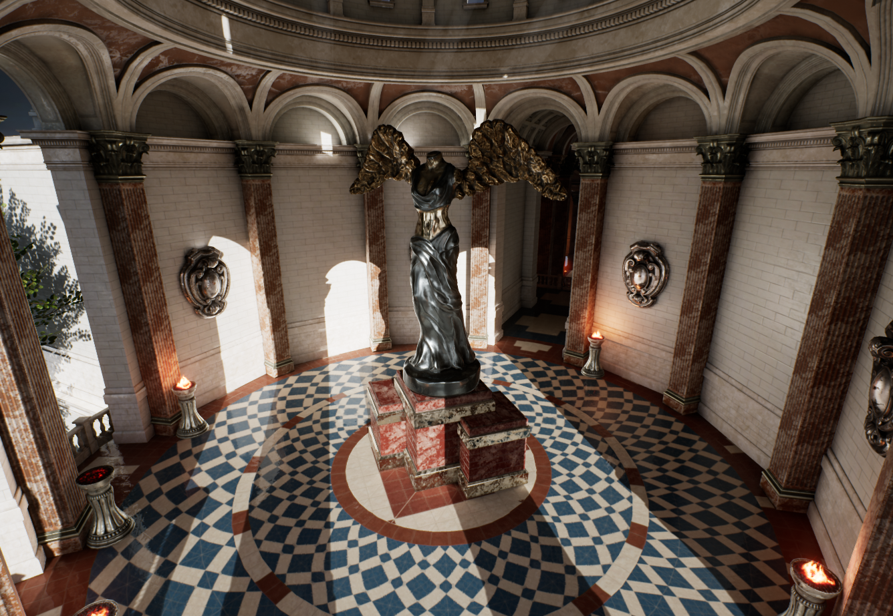
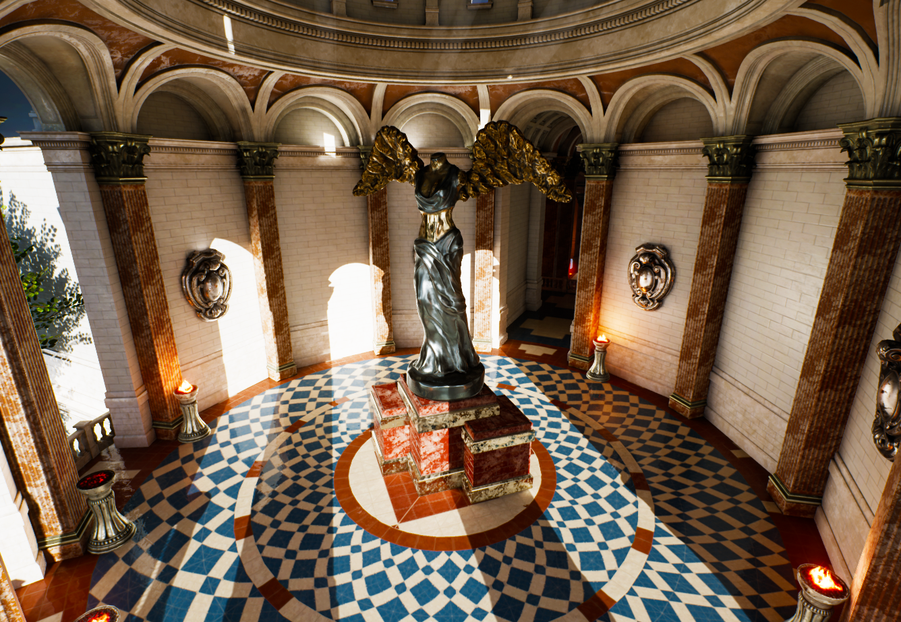

# 使用LUT纹理

要使用LUT，请使用下列属性将LUT纹理分配到要搭配它使用的后期处理体积并调整它的强度。

|属性|说明|
|--|--|
|颜色分级LUT强度（Color Grading LUT Intensity）|一种控制颜色校正效果的比例因子。|
|颜色分级LUT|用作颜色校正的查找表的LUT纹理。 详见下方示例|

## 颜色分级LUT

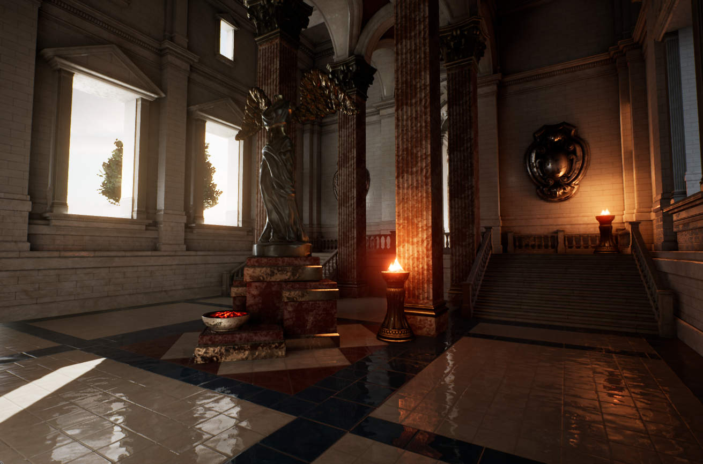
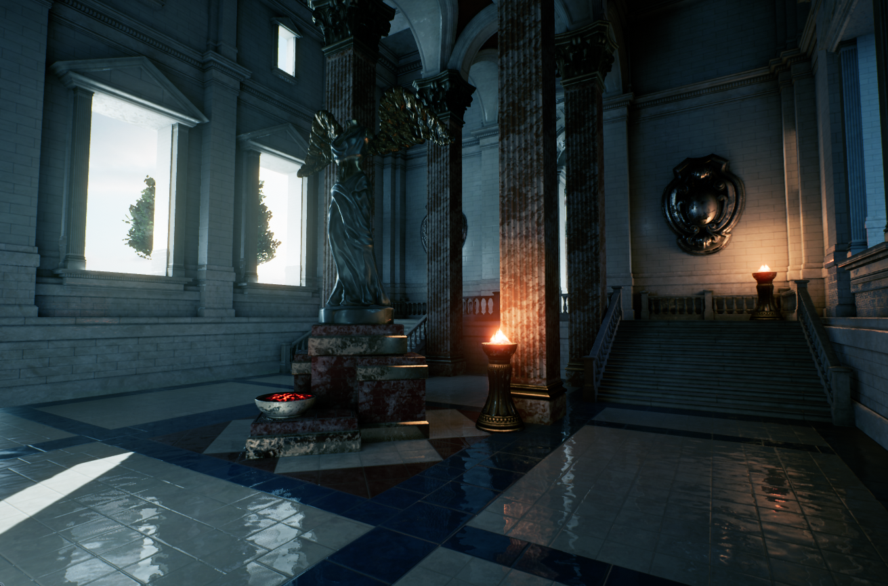
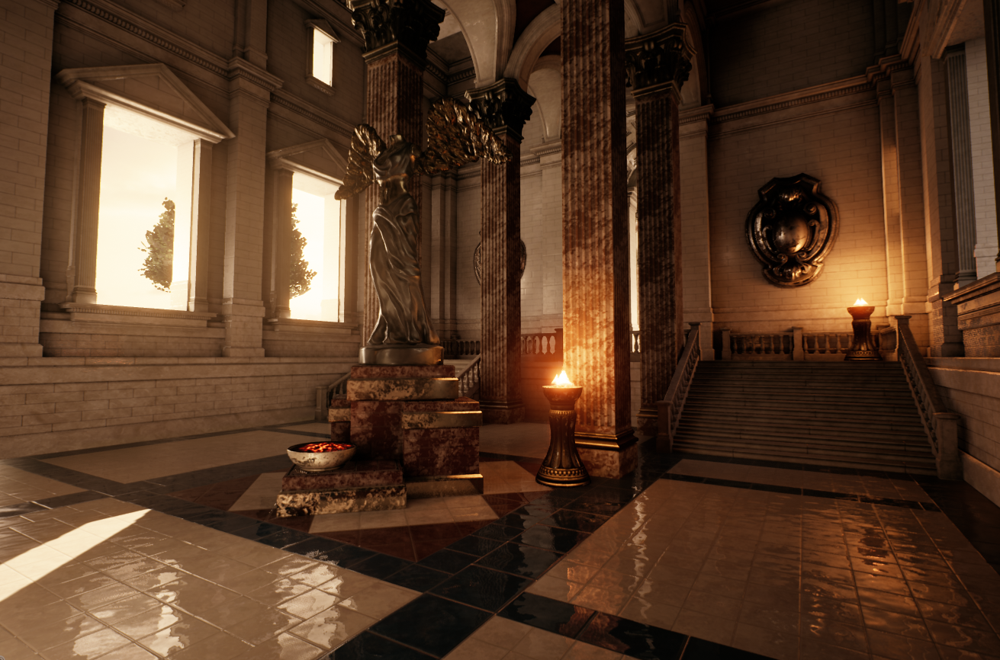

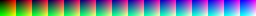

# 创建自己的LUT纹理

要创建你自己的LUT纹理，首先需要一个能够对捕获的图像进行颜色调整的图像编辑应用程序（例如Photoshop或GIMP）。 在这个演示中， 我们将使用在Epic Games启动程序中的 学习（Learn） 选项卡中提供的 Sun Temple 项目，并选择Photoshop作为LUT图像编辑应用程序。 在这个示例中使用的某些术语可能是 Photoshop特有的。

1. 首先对你也要应用颜色校正的场景截取至少一张有代表性的屏幕截图。 可以使用编辑器中提供的 截图工具来截取场景的高分辨率图像。

2. 在Photoshop中打开该屏幕截图，然后从右侧图层（Layers）面板上方的调整（Adjustments）选项卡添加你自己的 调整 图层。 在这里可以找到许多不同的图标，分别代表可以对图像执行的各种更改类型，例如亮度和对比度、色调、饱和度，等等。

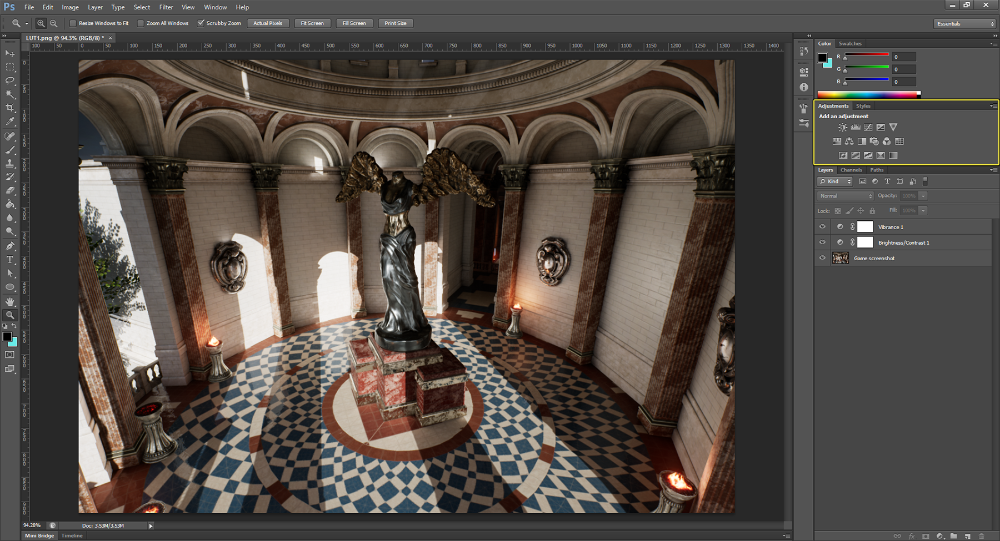

3. 在 调整（Adjustments） 面板中，单击任何图标以向图层（Layers）面板添加图层。 可以使用这些图层对最终图像作特定的颜色校正。 在此示例中， 已经添加和调整了 Vibrance 和 亮度/对比度（Brightness/Contrasts）。 将这些图层添加到图层（Layers）面板之后，从列表中选择它们以公开它们的属性，如果看不到属性， 可以右键单击并选择 编辑调整（Edit Adjustment） 来公开它们。

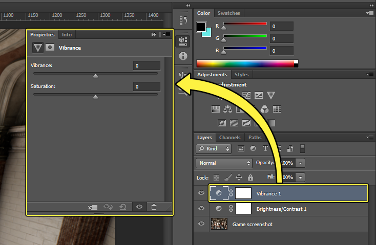

4. 你进行的任何调整都可以显示在视口中。 请调整调整图层的属性，直到获得想要的颜色校正效果为止。 在下面的示例中，已经调整了 Vibrance和亮度/对比度（Brightness/Contrasts）的调整图层属性，使屏幕截图的颜色饱和度和清晰度更高，更有视觉吸引力。

5. 既然你已经通过调整图层实现了所需的视觉效果，那就需要另外打开 中性色调LUT 的一个副本。 可以将为屏幕截图创建的调整图层拖动到该中性色调LUT上。打开带有调整图层的屏幕截图和中性色调LUT后，将调整图层从屏幕截图的图层（Layers）面板 拖放 到中性色调LUT图像上。 此时你应该会看到它们填充在LUT的图层（Layers）面板中。
6. 现在，导航到 File（文件） > Save As（另存为），给经过颜色校正的LUT提供一个名称。
7. 将经过颜色校正的LUT导入编辑器中，可以将其 拖放 到内容浏览器（Content Browser），也可以使用内容浏览器（Content Browser）中提供的 Import（导入） 按钮。

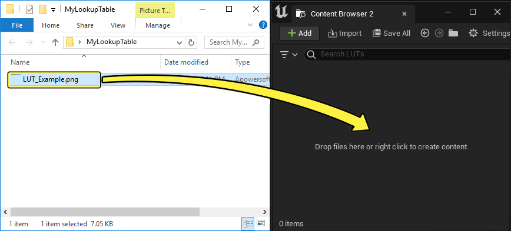

8. 要在后期处理体积中使用LUT获得最佳效果，在纹理编辑器（Texture Editor）中打开LUT图像，设置下列属性：

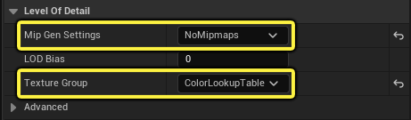

9. 接下来，在后期处理体积中，使用 细节（Details） 面板，在 颜色分级（Color Grading） > 全局（Global） 部分，启用 颜色分级LUT（Color Grading LUT） 并应用您的LUT。

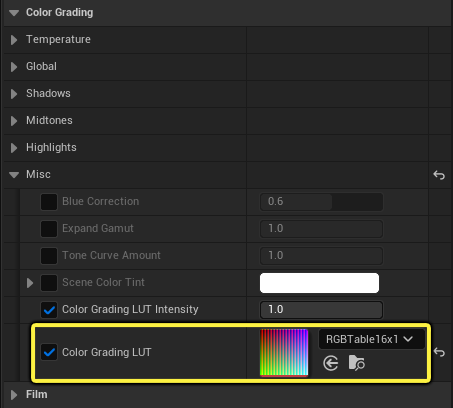