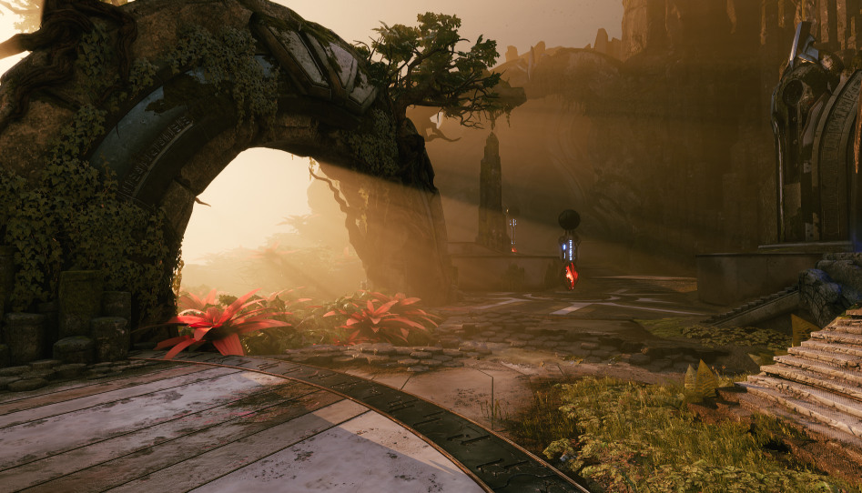

体积雾（Volumetric Fog）时指数高度雾组件的一个部分。体积雾（Volumetric Fog）将计算摄像机视锥体中每个点的参与介质密度和照明，以支持不同的密度和影响雾的任意数量光源。

# 体积雾控制
设置和调整体积雾时，你可以全局控制它，也可以在场景中局部控制它。全局控制功能使你能够使用指数高度雾（Exponential Height Fog）组件控制整个场景的雾。局部控制功能使你能够通过在可以生成粒子的区域中使用粒子的方式控制雾。

## 全局控制
要控制体积雾，你可以调整指数高度雾（Exponential Height Fog）中的属性和每个光源上的属性，以控制光源的贡献量。

## 指数高度雾
# 性能
体积雾的GPU开销主要通过体积纹理分辨率控制，可在引擎可延展性的阴影级别设置它。