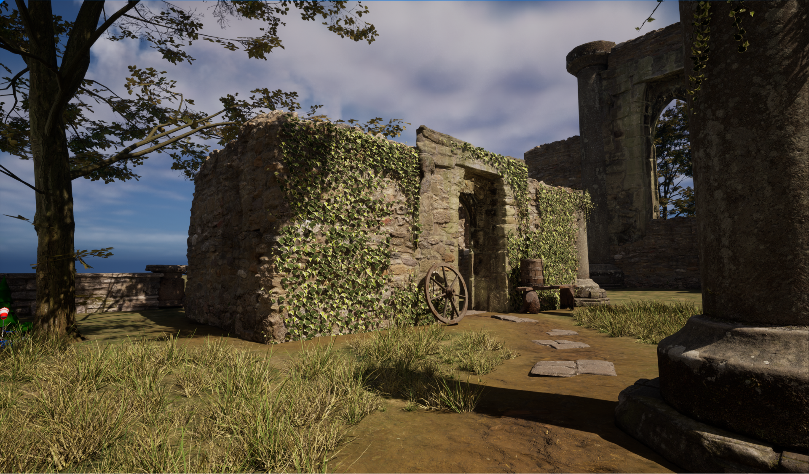

数据层（Data Layers） 是世界分区中的一个系统，用于在编辑器中和在运行时整理Actor。

使用数据层资产和数据层实例，你可以在编辑器中动态加载和卸载层，以此实现复杂的关卡效果。该系统旨在取代旧版本虚幻引擎中先前的层系统。

借助数据层，你可以在编辑器中将游戏逻辑类元素和环境资产分隔开来。美术师可以单独处理特定元素，不会受到游戏逻辑触发器或游戏对象的干扰。设计师则可以借助数据层的动态加载来设计有趣的游戏体验，并让关卡过度更加丰富多变。

在运行时，你可以使用蓝图或C++代码切换数据层，进而驱动游戏逻辑（如任务、进度和游戏内事件）。数据层是在世界分区工作流程中管理资产流送的重要工具。

# 创建数据层

数据层分为两种类型的资产：数据层资产和数据层实例。数据层资产包含交叉世界数据，使用数据层大纲视图（Data Layers Outliner）或在 内容浏览器（Content Browser） 中创建。数据层实例包含世界特定数据，在 数据层大纲视图（Data Layers Outliner） 中创建。

> 数据层（Data Layers）系统要求你在地图中启用 世界分区（World Partition） 。你可以使用 工具（Tools）> 转换关卡（Convert Level） 或使用命令将地图转换为世界分区。有关将现有关卡转换为世界分区的更多信息，请参阅世界分区。