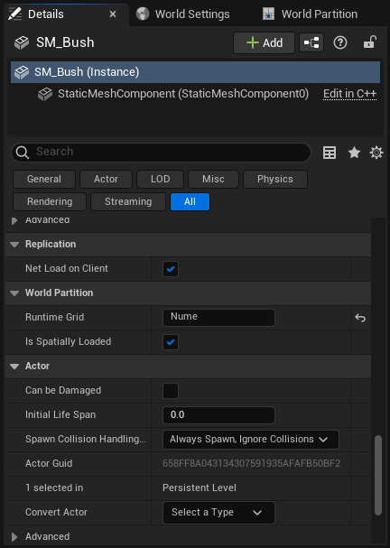

以往开发者在制作大型地图时，需要手动将其分为多个子关卡，然后在玩家穿越地形时使用关卡流送系统加载和卸载子关卡。 这样的方法往往导致多用户共用文件的问题，并且使得开发者难以同时审视整个地图。


世界分区是一种自动数据管理和基于距离的关卡流送系统，为大型世界管理提供了完整的解决方案。 以前需要将单个持久关卡中的世界存储到网格单元格中，以便将大型关卡划分成子关卡，但现在的系统已经不需要如此操作，并且你能够使用自动流送系统，根据与流送源的距离来加载和卸载这些单元格。

世界分区常常与以下功能搭配使用:
- 一Actor一文件
- 世界分区 - 数据层
- 关卡实例
- 世界分区 - 分层细节级别

# 启用世界分区

在虚幻引擎中启用世界分区的三种方法：
- 使用游戏（Games）类别下的模板创建新项目。
- 使用开放世界（Open World）模板创建新关卡。
- 转换已有的关卡来使用世界分区。

## 使用游戏模板创建你的项目

在游戏（Games）类目下的很多项目模板中，世界分区默认启用。


为了在创建新项目时化繁为简并提供可伸缩的解决方案，可使用世界设置（World Settings）下的启用流送（Enable Streaming）选项来启用或禁用网格单元格流送。


以下模板使用世界分区，但默认禁用启用流送（Enable Streaming）选项：
- 空白（Blank）
- 第一人称（First Person）
- 第三人称（Third Person）
- 俯视角（Top Down）
- 高级载具（Vehicle Advanced）

## 使用开放世界默认地图

默认的开放世界（Open World）地图被设计为创建大型开放世界地图的起始参考，并且默认启用以下功能：
- 世界分区
- 一Actor一文件
- 数据层
- 分层细节级别


该地图包括一个2km x 2km的地形示例，采用户外环境的地形材质和光照设定。 包括天空大气系统、天空光照、定向光源、指数高度雾、体积云。


在你的项目中使用默认的开放世界（Open World）类型地图：
1. 打开文件（File）菜单并选择新关卡（New Level）。
2. 选择开放世界（Open World）地图类型。
3. 点击创建（Create）按钮创建新地图。

## 转换已有的关卡来使用世界分区

你可以使用工具（Tools）> 转换关卡（Convert Level）选项向任何关卡添加世界分区，或者使用世界分区转换Commandlet。

使用世界分区转换Commandlet的步骤如下：


命令：`UnrealEditor.exe QAGame -run=WorldPartitionConvertCommandlet Playground.umap -AllowCommandletRendering`
```
[/Script/UnrealEd.WorldPartitionConvertCommandlet]
	EditorHashClass=Class'/Script/Engine.WorldPartitionEditorSpatialHash
	RuntimeHashClass=Class'/Script/Engine.WorldPartitionRuntimeSpatialHash
	LevelsGridPlacement=(("/Game/Maps/Highrise_Audio", Bounds),("/Game/Maps/Highrise_Collisions_Temp", Bounds),("/Game/Maps/Highrise_Gameplay", Bounds),("/Game/Maps/Highrise_Lights", Bounds),("/Game/Maps/Highrise_Vista", AlwaysLoaded))
	HLODLayerAssetsPath=
	DefaultHLODLayerName=

	[/Script/Engine.WorldPartitionEditorSpatialHash]
	CellSize=51200
	WorldImage=None
	WorldImageTopLeftW=(X=0.000000,Y=0.000000)
	WorldImageBottomRightW=(X=0.000000,Y=0.000000)

	[/Script/Engine.WorldPartitionRuntimeSpatialHash]
	Grids=(GridName="MainGrid",CellSize=3200,LoadingRange=25600.000000,DebugColor=(R=0.500000,G=0.500000,B=0.500000,A=1.000000))
```
# 使用世界分区

世界分区系统将创建的世界储存在一个持久关卡文件中，并且使用可配置的运行时网格将空间划分为可流送的网格单元。 这些网格单元在运行时由流送源（比如玩家）控制加载和卸载。 这样一来，虚幻引擎只加载关卡中玩家能看到并与之互动的部分。

## 世界分区中的Actor

编辑世界时，Actor可以被加入到任何地点，并根据其空间化加载（Is Spatially Loaded）的设置被自动分配至网格单元。该选项位于Actor细节（Details）面板的世界分区（World Partition）分段。



|选项|说明|
|--|--|
|运行时网格（Runtime Grid）|判定Actor被放置在哪一个分区网格。 如果为无（None），网格将会由分区系统决定。|
|空间化加载（Is Spatially Loaded）|确定Actor是否为空间化加载：若启用，该Actor将会在进入任何流送源的范围内且并未被分配至禁用的数据层时加载。若禁用，则只要没有被分配至禁用的数据层，该Actor就会被加载。|